```{r setup, include=FALSE}
knitr::opts_chunk$set(echo = FALSE)
```
# 1.0 Overview

This post is focusing on Chart 6 - Resident Labour Force by age per cent from Report: Labour Force in Singapore 2019. The tasks for this DataViz Makeover are as followed:

- Critic the graph on its clarity and aesthetics
- Suggest alternative graphical presentation to improve and provide a proposed design
- Design proposed data visualization using Tableau
- Provide Step-by-Step description of data visualization preparation
- Describe three major observations 

#  2.0 Critics 

## 2.1 Clarity

Firstly, **the title of the chart is misleading**. The words “Resident Labour Force by Age” are in bold whereas the words “per cent” are represented with a smaller font. At first glance, readers may assume that the visualization portrays the number of resident labour force by age in either thousands or million, instead of the percentage of resident labour force (RLF) by age bands.

This visualization **shows percentage of RLF by age band of 5 years intervals.** To derive the following insight *“the share of RLF aged 25-54 declined from 75% to 67%”*, readers must manually sum up the values in the tables. There is no data supporting the claim in the increase in Labour Force Participation Rate (LFPR) of older residents. 

Readers are **not able to derive the median age based on the visualization**, apart from the 2 annotations on median age. The values plotted in the visualization are percentage of labour force by each age-band. To find the 50th percentile, readers must manually add up the values in the table to find the median age. 

Lastly, by representing RLF by age in percentages, readers do not have any insights on **the absolute size of labour force for each age band in 2019 and 2009**. It is difficult to observe how population cohorts move across age bands. Hence, it is not possible to derive the following 2 statements from the visualization:   

- Share of resident aged 55 and above rose partially due to population ageing
- Decrease in percentage of RLF of age band 25-29 due to lower birth rates. 

## 2.2 Aesthetics

There is **no proper labeling of both axis for the line graph**. Other than the name of the chart “Resident labour force by age per cent”, there is no indication of what the values on the y-axis represents. Units are not indicated in the table.  This might confuse readers into thinking that it represents the RLF  in millions or thousands. 

The **color used** for both the x-axis (age band) and the trend line for June 2009 are both grey. There is no visual contrast.

As there is **no clear legend**, there are multiple annotations on the visualization, including the labeling of the 2 trend lines for 2009 and 2019 and the 2 reference lines indicating the median age. This makes the visualization cluttered and wordy.

#  3.0 Alternative Graphical Representation

The current data visualization lacks details on LFPR as well as the absolute number of labour force for the population cohorts.Hence, the proposed design comprises 4 data visualizations, in order to provide the 4 key insights in the statement.

```{r}
knitr::include_graphics("sketch2.jpg")
```
**DataViz 1** shows the percentage of resident labour force for 3 key age-bands, namely 15-24, 25-54 and 55 and above. The use of stacked bar graph will allow readers to visualize the share of RLF in both 2009 and 2019. **DataViz 2** shows the LFPR of 2009 and 2019 across age-bands. **DataViz 3** show the cohort size of each age band, and how population cohorts move across age-bands. Lastly, **DataViz 4** shows the cumulative total of RLF in percentage. By plotting the 50-percentile reference line, it shows the increase in median age in 2019.

The proposed data visualization is designed using Tableau and can be found [*here*](https://public.tableau.com/profile/mei.siew.toh#!/vizhome/DataVizMakeover1_16117611956640/ResidentLabourForce)

#  4.0 Data Visualization Preparation

## 4.1 Data Preparation

### For DataViz 1, 3 and 4 

The dataset used is from Table 7 RESIDENT  LABOUR  FORCE  AGED  FIFTEEN  YEARS  AND  OVER  BY  AGE  AND  SEX,  2009 - 2019  (JUNE), the excel sheet in Tab – T7_T. The data is available at https://stats.mom.gov.sg/Pages/Labour-Force-Tables2019.aspx.

In this excel sheet, column E and Z correspond to the data in Year 2009 and 2019. The remaining columns are removed as they are not required. Row 6 shows the total resident labour force for each year, and deleted, since Tableau has calculated field functions to generate the required data.

```{r}
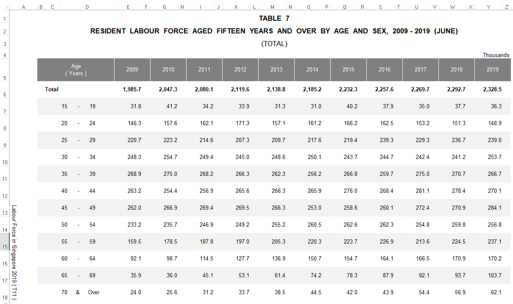
``` 

The revised datasheet is imported into Tableau for further data visualization preparation. The categorical variable – Age(Years) occupies 3 columns (A,B,C) and hence Column A and B contains null values.  These 3 columns are selected and “Merge Mismatch Fields” is selected. The column is renamed to “Age (Years)”. All 3 variables and their respective data types are mapped accurately by Tableau.

```{r}
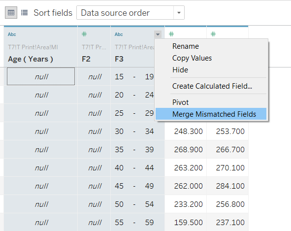
``` 
### For DataViz 2

The dataset used is from Table 5 RESIDENT  LABOUR  FORCE  PARTICIPATION  RATE  BY  AGE  AND  SEX,  2009 - 2019  (JUNE), the excel sheet in Tab – T5_T. The data is available at https://stats.mom.gov.sg/Pages/Labour-Force-Tables2019.aspx.

In this excel sheet, column E and Z correspond to the data in Year 2009 and 2019. The remaining columns are removed as they are not required. Row 6 and row 19 onwards are deleted as well.

```{r}
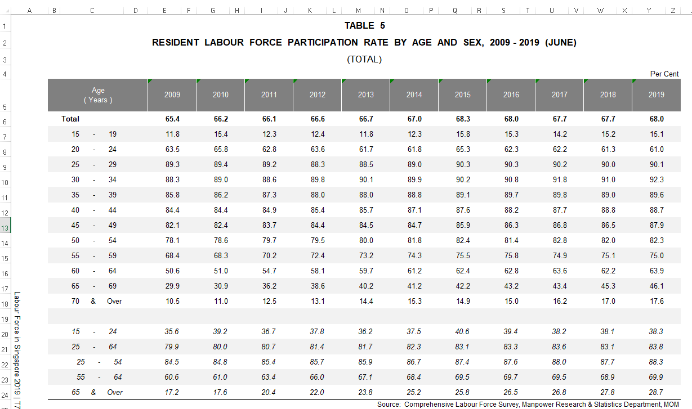
``` 

The column 2009 and 2019 are renamed to 2009 (%) and 2019 (%) All 3 variables and their respective data types are mapped accurately by Tableau.

```{r}
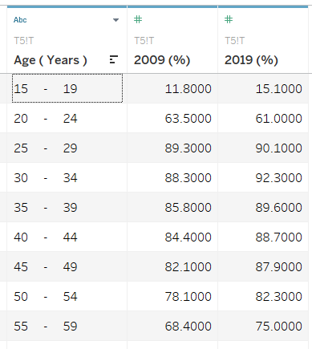
``` 

## 4.2 Data Visualization Preparation

### Data Visualization 1 - Percentage Share of Labour Force By Age Band

**Creating new calculated field**

To find percentage share of RLF for each age band, 2 new calculated fields are created.

```{r}
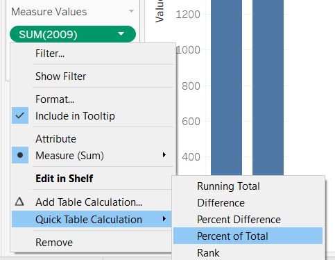
``` 

**Grouping of Dimensions**

Instead of showing 12 age-bands, the age-bands will be collapsed only 3 age-bands by using the grouping function.The final age-bands are 15 to 24, 25 to 54 and 55 and above. The new dimension is re-labeled as Age Band (Years), the 3 age bands are renamed and re-colored into 3 distinct colors.

```{r}
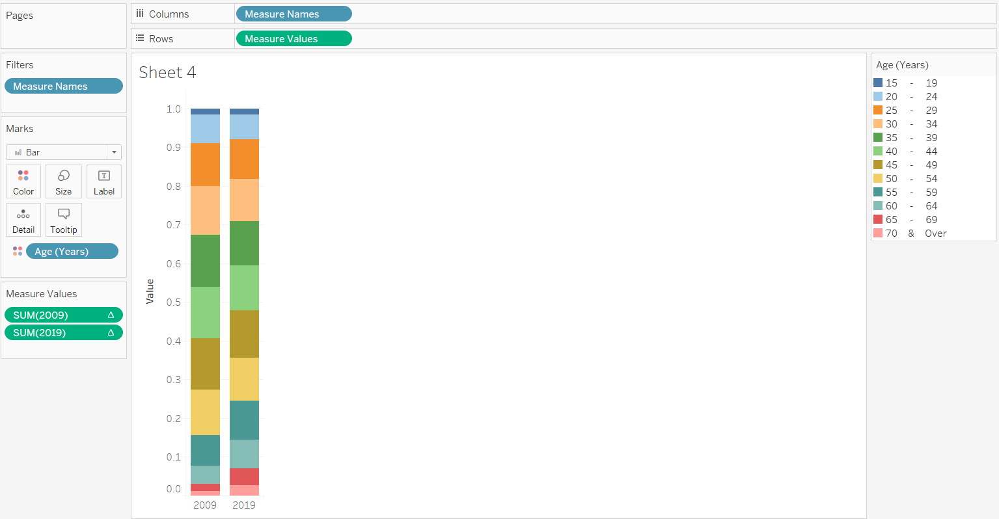
``` 

```{r}
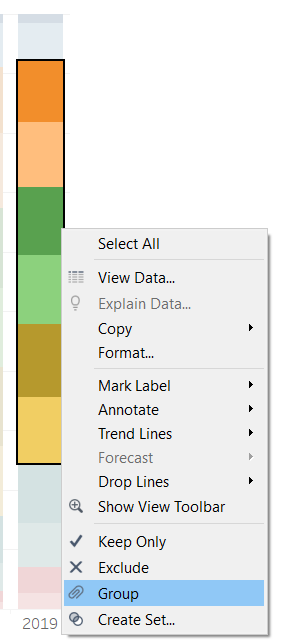
``` 

**Final Layout**

The visualization is given a proper header and the y-axis is fixed with the range 0% to 100%. The y-axis is also renamed as “Share of Resident (%)” The values are labeled by selecting “Show Mark labels” to provide readers more clarity on the values. 

```{r}
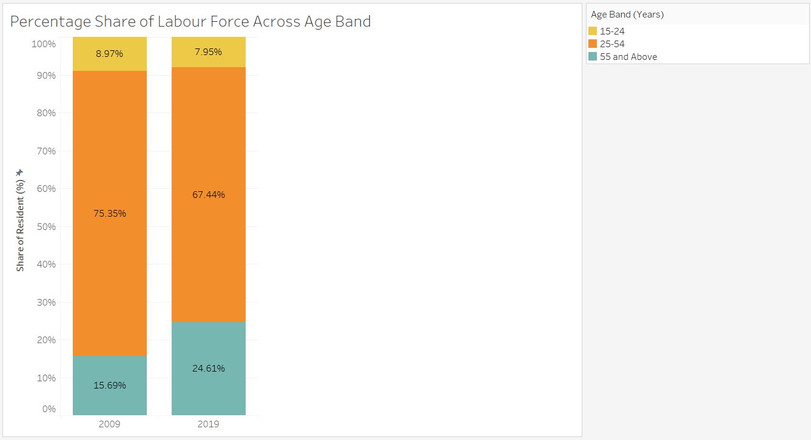
``` 

### Data Visualization 2 - Labour Force Participant Rate by Age Band

**Creating a line graph**

[Age (Years)] are placed at the columns whereas [Measure Values], which include summation of LFPR in 2009 and 2019 are placed in the rows. 2009 is represented by blue whereas 2019 is represented by red. The marks are changed to line graph. The visualization is given a proper header. The y-axis is also renamed as “Labour Force Participation Rate (%)”

```{r}
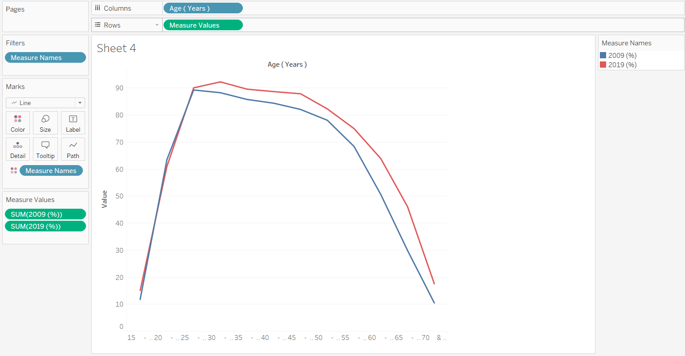
``` 

```{r}
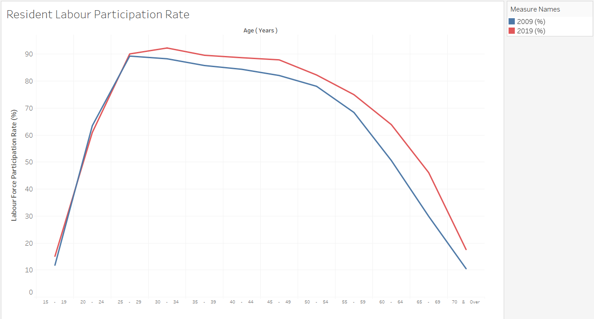
``` 

### Data Visualization 3 - Cumulative Total of Resident Labour Force by Age

**Creating new calculated field**

To find the cumulative total of residents in 2009 and 2019, 2 calculated fields are created using the following equation *RUNNING_SUM(SUM([2009])) / TOTAL(SUM([2009]))*

```{r}
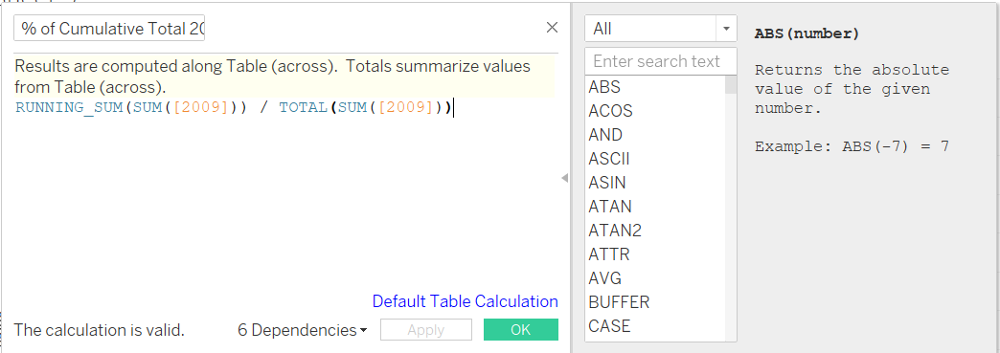
``` 

**Final Layout**

The 2 new fields are renamed as % of Cumulative Total 2009 and 2019 respectively. The 2 measure values are selected into the rows of the visualization, with 2009 represented by blue and 2019 represented by red. The mark is changed to line to show the gradient of the cumulative total.The visualization is given a proper header and the y-axis is fixed with the range 0% to 100%. The y-axis is also renamed as “Cumulative Total of Resident(%)” 

```{r}
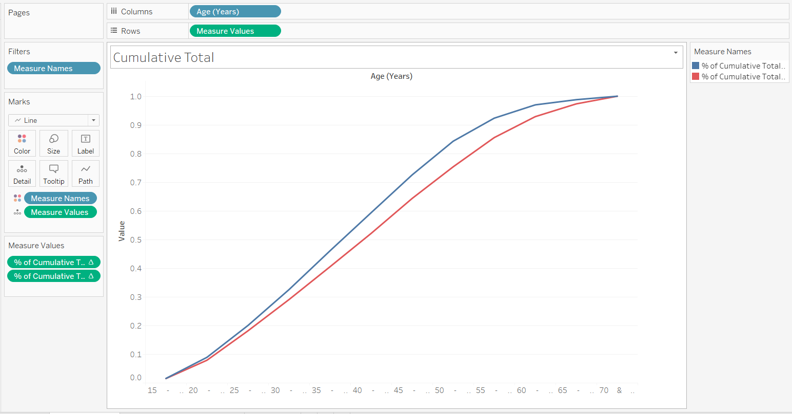
``` 

**Adding Reference Line and Annotation**

To show the median age of labour force in 2009 and 2019, a reference line at the 50 percentile is added. As the x-axis consists of age-band instead of age, annotations are included to provide more clarity

```{r}
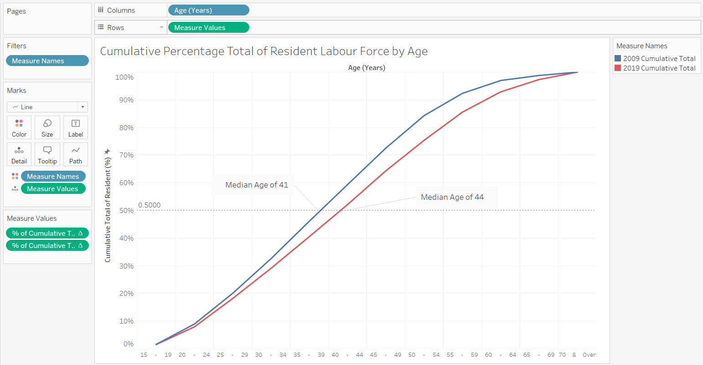
``` 

### Data Visualization 4 - Resident Labour Force by Age

**Creating a Histogram**

[Age (Years)] and [Measure Names] are placed at the columns whereas [Measure Values], which include summation of number of residents in 2009 and 2019 are placed in the rows. Keeping the colors consistent, 2009 is represented by blue whereas 2019 is represented by red. The marks are changed to bar for easier comparison between age bands

```{r}
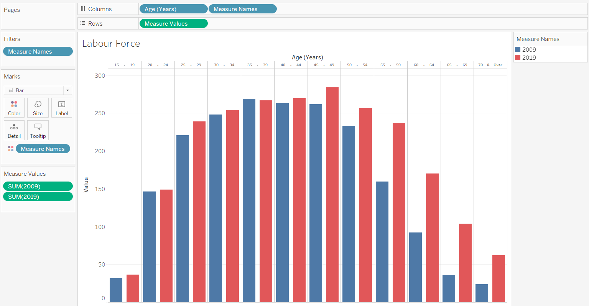
``` 

**Final Layout**

The visualization is given a proper header. The y-axis is also renamed as “Number of Residents (‘000)”. Only the bars with a significant difference in values  are being marked to avoid cluttering


```{r}
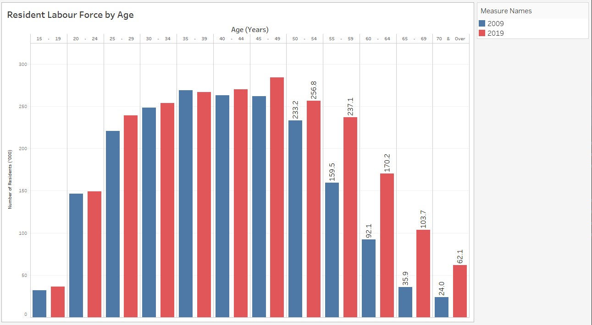
``` 

#  5.0 Major Observations

**1. Later retirement age**

In 2009, residents aged 35-39 have the most number of residents in labour force whereas in 2019, residents aged 45-49.  This is the same population cohort that moved across age-band after 10 years. Comparing the population cohorts between age 35 to 49  in 2009 and the population cohorts between age 45 to 59 in 2019, there is minimum reduction in residents per population cohort. This suggests this population cohort retire at a later age, as compared to 2009. 

**2. Baby boomers - Spike in population aged 55 and above** 

There is a substantial increase in residents in labour force above age 55 due to 2 reasons:

- Increase in RLFR as compared to 2009 as supported by 2nd visualization  
- Spike in population, with baby boomers born between 1947 to 1964 who are aged 55 and above in 2019.

**3. Entering workforce at a later age**

In 2009, the population cohort of 25-29 has the highest RLPR whereas in 2019, the population cohort of 30-34 has the highest RLPR instead. This implies that the average age to enter workforce in Singapore has increased, probably due to additional years of education.

