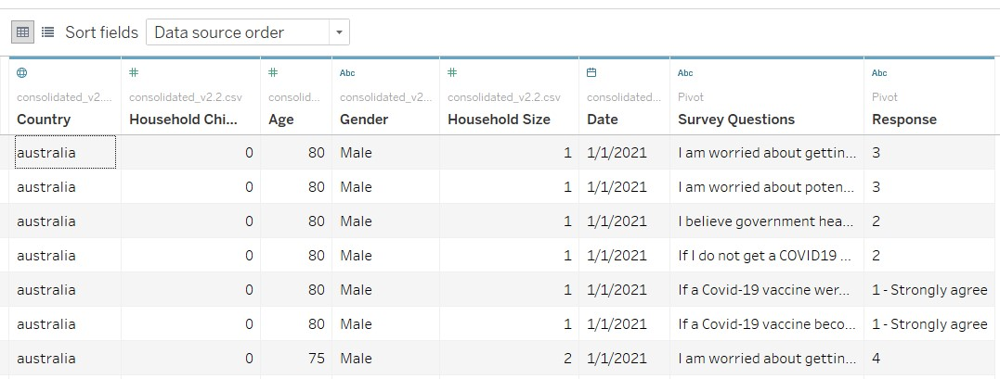

```{r setup, include=FALSE}
knitr::opts_chunk$set(echo = FALSE)
```

# 1.0 Overview

This post is focusing on the 2 data visualization found in DataViz Makeover 2 for ISSS608 Visual Analytics and Applications. The tasks for this DataViz Makeover are as followed:

- Critic the graph on its clarity and aesthetics
- Suggest alternative graphical presentation to improve and provide a proposed design
- Design proposed data visualization using Tableau
- Provide Step-by-Step description of data visualization preparation
- Describe three major observations 


The original data visualizations are as seen below:


```{r}

``` 

#  2.0 Critics 

## 2.1 Clarity

**Misleading Title based on only 1 survey question**

The data used in the 1st bar chart (DataViz1)  “Which country is more pro-vaccine?” is retrieved from the responses in the survey question –vac-1: “If a Covid-19 vaccine were made available to me this week, I would definitely get it”. The title is misleading, as this survey question only is unable to determine if a country is more “pro-vaccine” than others. 

In addition, in the 2nd bar chart(DataViz2), the title is misleading as users will assume that the survey question is “I would definitely get a vaccination” and fail to consider the context – “available to me this week” 

**Limitation in Survey Question**

This visualization also failed to consider changes in responses week on week, as the time frame mentioned in survey question is limited “this week”. Given that updates and news on COVID-19 happen rapidly daily, survey responses can change over weeks. The graph is unable to show any trend in responses throughout the 4 weeks in January.

**Missing data representation of uncertainty**

DataViz2 “% of strongly agreed to vaccination” is redundant as it is a filtered version of Graph 1, showing only the percentage of population who strongly agree to survey question vac-1.Apart from arranging the countries via the country with the highest percentage of strongly agree, it does not provide any additional insights. As there can be different number of survey records per country, it does not show any error bar constructed with confidence interval. Overall, it lacks the additional input to showcase the level of uncertainty. 

**Missing timeframe in data visualization**

The survey is done across 29 countries, with the addition of Israel in 2021. In both DataViz1 and DataViz2, only 14 countries are shortlisted and represented in the data visualization. There is no write-up or annotation to explain the reason to exclude the other 15 countries. In addition, the survey collects results weekly from 31st March 2020 to  date from 2020 to 2021 and it is uncertain which time frame the visualization is based off. It was only then mentioned in the writeup that the research is based off the survey results in Jan 2021.

**Lack of demographic details**

Lastly, there is no demographics details to further breakdown the responses. Users can only compare results across countries but unable to compare any plausible relationship between response and attributes such as gender, age, household size.

**Arrangement of Countries**

Countries in DataViz1 are arranged based on alphabetical order. In the current stacked bar chart visualization, this arrangement does not bring any additional value to the users. It is hard to find the country with the highest percentage of “Strongly disagree” without scanning through the entire graph. The sorting of countries in Graph 2 is based descending order of percentage values, bringing users ‘attention to the top countries. However, it is time consuming for users to toggle between 2 graphs since the countries are arranged differently. The arrangement of both charts should be standardized.

## 2.2 Aesthetics 

**Choice of Color**

Firstly, the scale of 1 to 5 is represented by 5 different colors that are not intuitive for readers. For example, a response of “3” is neutral but represented by the color – red which typically inferred as negative. Users are required to refer to the legend, making it cumbersome to analyze the data visualization. 

**Stacked Bar Chart**

DataViz1 is represented by a stacked bar chart to show the distribution across the 5 response. The stacked bars are all plotted from the same reference line starting from 0%. Even though users can see the weightage of each response, they are unable to compare the weightage of positive and negative responses right away. The chart itself lacks a standardized divergent point to visually interpret the distribution of positive (agreement), negative (disagreement) and neutral responses. 

**Axis and Grids**

The vertical axis header “Country” is aligned on the right for DataViz1 but aligned to the left for DataViz2, showing inconsistencies. Both the headers “Country” and “% Strongly Agree” have the “Sort” symbol. At first look, users might think that the countries are sorted by alphabetical order. The value labels of the x-axis for DataViz2 has decimal places, which are redundant. In addition, the axis stops at 60%, whereas united kingdom has a value more than 60%, making the data visualization ugly and cluttered. There is no proper boundary between the legend and the visualization. 

# 3.0 Alternative Graphical Representation 

## 3.1 Suggested Improvements

**Additional Survey Questions**
*(Issues to Tackle: Misleading Title, Limitation in survey question)*

- To include results of additional survey questions, with the questions as a filter
- Title will be referencing to the survey question instead of “Which country is more pro-vaccine?”

**Error Bar on Dot Plot**
*(Issues to Tackle: Missing data representation of uncertainty)*

- To change DataViz2 into error bar constructed using a confident interval determined by user.

**Including Time Frame**
*(Issues to Tackle: Missing timeframe in data visualization)*

- To include time frame as a filter
- As different countries started the survey on different weeks, the date will be used as a filter instead of week number
- To add an additional visualization not show the entirety of the data, to show the trend of responses over weeks.

**Adding Demographics Breakdown**
*(Issues to Tackle: Lack of demographic details)*

- To add an additional parameter – Demographics into tool tip
- Tool tip will be dynamic based on selection, with the option to breakdown into gender, age, household size, household children and employment status. 

**Consistency in Both Data Visualization**
*(Issues to Tackle: Arrangement of Countries, Axis and Grids)*

- To keep arrangement of countries consistent by using alphabetical order for ease of comparison.
- To keep header alignment and axis values decimal points consistent.
- To space out the bars in DataViz1 and to remove “Sort” symbol in DataViz2

**Building a Likert Chart**
*(Issues to Tackle: Color, Stacked Bar Chart)*

- To change DataViz1 to a Likert Chart with the following color scale
- 5- strongly disagree as dark red, 4 – disagree at red, 3 – Neutral as grey, 2 – Agree as blue, 1 – Strongly Agree as Dark Blue

## 3.2 Alternative Graphical Representation

The draft for DataViz Makeover can be seen below, where the 2 key visualizations are i) a Likert Graph and ii) An Error Bar with dot plot.

```{r}

``` 

The proposed data visualization is designed using Tableau and can be found [*here*](https://public.tableau.com/profile/mei.siew.toh#!/vizhome/DataVizMakeover2_16135874105970/COVIDDashboard)

# 4.0 Data Visualization Preparation

## 4.1 Data Preparation

The dataset used is obtained from Imperial College London YouGov Covid 19 Behavior Tracker Data Hub hosted at Github.  The data is available at [*https://github.com/YouGov-Data/covid-19-tracker*](*https://github.com/YouGov-Data/covid-19-tracker). A total of 29 datasets is extracted, with each dataset representing 1 country. Israel will not be part of the data preparation as it only has 1 week of data. 

Using “Get Data “function in excel, all the 29 datasets are merged into a single CSV file

```{r}
knitr::include_graphics("images/3-Getdata.jpg")
``` 

A new column is created, containing the source of the data. 

```{r}

``` 

The 1st column is renamed as “Country” and for all values under column A, “.csv” is removed. Using the new dataset, the columns selected are time of survey (endtime), demographics details: Household_Children, Age, Gender, Household size, employment_status) and survey results (vac_1, vac_2,vac2_1, vac2_2, vace2_4, vac2_6 and vac3). Only 2021 survey results are filtered and retained. Endtime is reformatted to follow the following format – MM/DD/YYYY. With these filters applied in this dataset, there are only 15 countries remaining for further exploration.

```{r}

``` 

The revised datasheet is imported into Tableau for further data visualization preparation

## 4.2 Data Visualization Preparation

The data type for each column is selected correctly on Tableau.

```{r}
knitr::include_graphics("images/6-Tableau.jpg")
``` 

The columns representing survey questions are renamed for better references. 
- Vac_1 : If a Covid-19 vaccine were made available to me this week, I would definitely get it:
- Vac_2_1: I am worried about getting COVID19
- Vac_2_2: I am worried about potential side effects of a COVID19 vaccine
- Vac_2_3: I believe government health authorities in my country will provide me with an effective COVID19 vaccine
- Vac_2_6: If I do not get a COVID19 vaccine when it is available, I will regret it
- Vac_3: If a Covid-19 vaccine becomes available to me a year from now, I definitely intend to get it


Using the pivot function, the dataset is transformed, with 2 new pivot field columns representing survey questions and responses. 

```{r}

``` 

```{r}

``` 

The 2 pivot fields are renamed as "Survey Questions" and "Response"

```{r}

``` 

For the column [Response], a new calculated field [Score] is created to only take into account the numerical value of the responses – i.e “1-Strongly agree” to be “1”.

```{r}

``` 

The dataset is now ready to be used for data visualization.

## 4.3 Creating a Likert Chart

As mentioned in section 2 and 3, the current stacked bar chart is plotted from the same reference line and is missing a standardized divergent point to show the polarity of the responses - agreement and disagreement. Hence, a Likert chart will be more suitable to show the distribution of responses through a standardized starting point.   

**Creation of Calculated Fields**

Before creating a likert chart, there are some calculated fields to be created.

1.	Number of Records: 1
2.	Total Count = TOTAL(sum([Number of Records]))
3.	Percentage = SUM([Number of Records])/[Total Count]
4.	Count Negative = 

```{r, echo=TRUE, eval=FALSE, message=FALSE}
IF  [Score]>3 then 1
ELSEIF [Score]= 3 THEN 0.5
ELSE 0
END
```

5.	Total Count Negative = Total(sum([Count Negative]))
6.	Gantt Start = -[Total Count Negative]/[Total Count]
7.	Gantt Percent = PREVIOUS_VALUE([Gantt Start])+ZN(LOOKUP([Percentage],-1))

**Plotting a Likert Chart**

[Gantt Percent] is placed on the Columns shelf and [Survey questions] is placed on the rows shelf. [Score] is dragged onto color and detail to break down the Gantt Percent values via [score] and to differentiate the different scores by colors. [Percentage] is dragged to size and [Gantt Bar] is selected as the mark type. Lastly, [Gantt Percent] is computed using score.

```{r}
knitr::include_graphics("images/11-Marks.jpg")
``` 

```{r}
knitr::include_graphics("images/12-Columns.jpg")
``` 

**Aesthetic Adjustments**

There are responses that are “null” as the survey questions may not be applicable to certain countries. The “Null” score is excluded in the data visualization. 

```{r}

``` 

The color scale is revised to be more intuitive, with the color scale mentioned in Section 3. 


```{r}

``` 

A reference line of value “0” is added, to show the divergent point of responses using the mid point of neutral responses. 

```{r}
knitr::include_graphics("images/16-Reference.jpg")
``` 

Aliases are added to extreme scores of 1 and 5 to show the value of the scores, with 1 as 1- Strongly Agree and 2- Strong Disagree

```{r}
knitr::include_graphics("images/14-Legend.jpg")
``` 

For the x-axis, [Gantt Percent] is renamed to Percentage and the values on the scale are represented in percentages instead of decimal

After ensuring the Likert graph is plotted accurately, [Survey Question] is replaced by [Country] in the rows section and [Survey Question] is placed as a filter. 

```{r}
knitr::include_graphics("images/17-Final.jpg")
``` 

**Final Touches**

[Survey Question] is also included dynamically as the title of the data visualization to provide more clarity to users.. Date is placed as a filter, with the range of dates limited to a week from 1st Jan to 7th Jan.

```{r}
knitr::include_graphics("images/18-Title.jpg")
``` 

Both the survey question and date filters are exposed to users. 

```{r}
knitr::include_graphics("images/19-Final.jpg")
``` 

Lastly, animation is added in to see how responses change between different survey questions.

```{r}
knitr::include_graphics("images/20-Animation.jpg")
``` 

## 4.4 Creating a Trend Graph

The Likert Chart is duplicated into a new sheet and revised to plot a trend graph. 

**Plotting a Line Graph**

Instead of using [Gantt Percent], [Percentage] is placed in the row shelf, computed using [Score]. [Date] is placed in the column shelf, showing the actual day. 

```{r}
knitr::include_graphics("images/21-Percentage.jpg")
``` 

The Mark type is set to “Line”, [Score] is removed from detail and [Percentage] is removed from size. 

```{r}
knitr::include_graphics("images/22-Marks.jpg")
``` 


Based on the trend graph, users are able to spot any spikes in extreme responses in the month of January

```{r}
knitr::include_graphics("images/23-Graph.jpg")
``` 

The survey question filter is removed for this data visualization.

## 4.5 Creating Demographic Breakdown Via Bar Chart

To provide more on-demand parameters that allow users to breakdown the results, a bar graph is plotted in a new worksheet.

**Reviewing Demographic Data**

The demographic data points shortlisted are

- Age
- Gender
- Household Children
- Household Size

For “Age”, the value ranges from 18 to 99 and hence, having 82 values for this dimension is not practical. Hence,  using the “Create Group” function, a new dimension – Age (group) is created and the ages are grouped into the following: 18-24, 25-34, 35-44, 45-54, 55-64 and 65 & Above.

```{r}

``` 


```{r}
knitr::include_graphics("images/25-Agegroup.jpg")
``` 

For Household Children, the values of this dimension do not match the actual number of children in the household Based on the codebook, the label “1”  , represents 0 children, and label “8” represents “Prefer not to say”. A quick pivot table on the dataset will show values  “0” and “7”that are not present in the codebook.  To avoid confusion, the values of this dimension can be re-adjusted to reflect the exact number of children.


```{r}
knitr::include_graphics("images/26-Code.jpg")
``` 


```{r}

``` 

However, it will be hard to determine whether the response refers to the number of children, or the labels, which represent a different value. As such, household children will not be part of the break down. 

Lastly, for household size, the label and the value matches.

```{r}

``` 

For survey responses with value “8”, they are group with “8 or more’”. 

```{r}

``` 

The new dimension is saved as “Household Number of Pax”

```{r}

``` 

The 3 demographics – Age(Group), Gender and Household Number of Pax are all in the dimension data form. 

**Creation of Parameter- Demographic Data**

A new parameter – Demographic Data is created, with a list of values that match the 3 dimensions.

```{r}
knitr::include_graphics("images/31-Parameter.jpg")
``` 

**Creation of Calculated field – Demographic**

A new calculated field – Demographic is created, with the following formula

```{r, echo=TRUE, eval=FALSE, message=FALSE}
CASE [Demographic Data]
WHEN "Gender" THEN [Gender]
WHEN "Household Number of Pax" THEN [Household Number of Pax]
WHEN "Age (group)" THEN [Age (group)]
END
```

```{r}
knitr::include_graphics("images/32-Calculated.jpg")
``` 

**Plotting Demographic Breakdown Via A Bar Chart**

[Demographic] is placed  on the Columns shelf and [Percentage] is placed on the rows shelf. The paramter – [Demographic Data] is exposed.

```{r}

``` 

**Aesthetic Adjustments on Bar Graph**

The header of the columns is hidden and the title of the visualization is based on the demographic data selected. 

```{r}
knitr::include_graphics("images/34-Title.jpg")
``` 

The axis is changed to represent percentages instead

```{r}
knitr::include_graphics("images/35-Graph.jpg")
``` 

## 4.6 Creating An Error Bar on a Dot Plot

For this data visualization, it is focusing on percentage of people who responded to “Strongly Agree” . As such, the error plot is working with confidence interval of a percentage, chosen by the user.

**Creation of Parameter- Confidence Level**

A new parameter – Confidence Level is created.
The most common confidence levels are 

- 99%
- 95%
- 90%

For each confidence level, the Z-score of each confidence level is recorded as Value and display as “Confidence Level”

```{r}
knitr::include_graphics("images/36-Confidence.jpg")
``` 

**Creation of Calculated Fields**

Before creating the error bar, there are some calculated fields to be created.
1. Count SA 

```{r, echo=TRUE, eval=FALSE, message=FALSE}
IF  [Score] = 1 THEN 1 
ELSE 0
END
```

2.	Prop = SUM([Count SA])/SUM([Number of Records])
3.	Prop_SE = SQRT(([Prop]*(1-[Prop]))/SUM([Number of Records]))
4.	Prop_Upper Limit = [Prop]+[ConfidenceLevel]*[Prop_SE]
5.	Prop_Lower Limit = [Prop]-[ConfidenceLevel]*[Prop_SE]

**Plotting an Error Bar on Dot Plot**

[Prop] and [Mesure Values] are placed  on the Columns shelf and [Country] is placed on the rows shelf. In [Measure Values], all the values are removed, with only [Prop_Lower Limit] and [Prop_Upper Limit] remaining.

```{r}
knitr::include_graphics("images/37-Plot.jpg")
``` 

The 2 visualisations are combined by selecting Dual Axis.

```{r}
knitr::include_graphics("images/38-Dual.jpg")
``` 

The axis are synchronized as well

```{r}

``` 

**Aesthetic Adjustments on Error Bar**

For [AGG(Prop)], the mark type is changed to circle, whereas for [Measure Values], the mark type is changed to line. [Measure Names] is dragged onto detail.

```{r}

``` 

```{r}

``` 

The parameter [Confidence Level] is exposed. The top header is also removed. 

```{r}

``` 

For the x-axis, [Prop] is renamed to Percentage and the values on the scale are represented in percentages instead of decimal
 
```{r}
knitr::include_graphics("images/43-Graph.jpg")
``` 

# 5.0 Tableau Dashboard Creation 

## 5.1 Creation of Zoom-in Function

To stich the likert chart, error bar and the time-series together, additional reference bands are added into the time-series chart. The time-series visualisation will serve as a slider that filter data based on the date range selected.

**Creation of Parameters**

The following parameters are created

- Date Slider: the entire January date range is selected, with step size of 1 day

```{r}
knitr::include_graphics("images/44-Date.jpg")
``` 

- Days: To create the range of days user will want to select. Currently, as the data used is only January, only 2 options- 7 days (1 week) and 31 days (Entire month) are created.

```{r}
knitr::include_graphics("images/45-Day.jpg")
``` 

**Creation of Calculated fields**

The start date selected on the slider will be placed at the start of the highlighted data.The two calculated fields mark the boundary of the date range selected.

- Lower Zoom Date: DATE(DATEADD('day',0,[Date Slider]))
- Upper Zoom Date: DATE(DATEADD('day',CEILING([Days]-1),[Date Slider]))

For both the Likert Graph and the error bar to show data filtered via the date slider, 2 binary calculated fields are created

- DATE([Date])>=[Lower zoom date]
- DATE([Date])<=[Upper zoom date]

These 2 fields are pulled into Filters, with the “True” condition

```{r}
knitr::include_graphics("images/46-True.jpg")
``` 

```{r}

``` 


**Creation of Reference Line**

Lastly, 2 reference bands are used to block out any dates that are not selected. For the first reference band, it is to block out the dates prior to the selected date range. [Lower Zoom Date] is selected as the maximum whereas [Date] is selected as the minimum. 

```{r}
knitr::include_graphics("images/48-Reference.jpg")
``` 

For the second reference band, it blocks out the dates later than the selected date range. [Upper Zoom Date] is selected as the minimum whereas [Date] is selected as the maximum.

```{r}
knitr::include_graphics("images/49-Reference.jpg")
``` 

The 2 parameters are exposed in the trend graph. 

```{r}

``` 

## 5.2 Creation of Tool-tip on Likert Graph

Going to the Likert Chart worksheet, selecting “Tooltip”, the [Demographic Data] parameter is selected, as well as the Demographic Worksheet. The parameter will serve as the header, hence centralized and in bold.

```{r}
knitr::include_graphics("images/51-Parameter.jpg")
``` 

By hovering over the selected responses, a user can understand the demographic breakdown of the respondents

```{r}

``` 
 
## 5.3 Creation of Dashboard

Firstly, both the Likert Graph and trend graph are selected and pulled into the dashboard. For the filter – [Survey Questions], the filter is applied to all using related data sources.

```{r}
knitr::include_graphics("images/53-Filter.jpg")
``` 
 
The date slider of the trend graph is moved to the bottom of the trend graph. The title is also hidden for aesthetic purposes. The title of the trend grpah is hidden and the graph is resized so that it sits nicely at the bottom of the dashboard.

```{r}
knitr::include_graphics("images/54-Slider.jpg")
``` 
 
The uncertainty graph is added on the right of the Likert Chart. 

```{r}

``` 
 
The title for the error bar is renamed to include the confidence level selected by the user and the title of the Likert Graph is also renamed for more clarity.

```{r}
knitr::include_graphics("images/56-Title.jpg")
``` 
 
```{r}
knitr::include_graphics("images/57-Title.jpg")
``` 

The Paramter [Days] are moved to be next to the slider, and renamed as “Duration (Days)” for more clarity.  Header is added for this data visualization to provide more context. 

```{r}

``` 

Lastly, borders and colors are added to ensure that the filter option for [Survey Questions] are easily seen by the user. The parameters – [Confidence Level] [Demographic Data] and [Duration (Days)] are added borders and shaded to show more visibility

```{r}
knitr::include_graphics("images/59-Color.jpg")
``` 

# 6.0 Major Observations

**Percentage of People Who are Open to Getting a Vaccine**
 
By toggling between 2 questions, people are more open to getting the vaccine after 1 year, instead of this week. Overall, the percentage of people who are highly agreeable are higher. Countries such as Australia and France show a higher percentage of people who are open to getting the vaccine in the long term but  not in the short term. 


```{r}

``` 


```{r}

``` 

**A spike in positive sentiments towards the vaccine**

With the time slider, the user is able to see how data changes over the weeks. For the week of 9th Jan, there is a spike in percentage of strongly agreeable. This based on the Likert Graph, it is largely due to UK. This week is also the week in UK with the highest number of COVID cases. It is possible that people are more open to the vaccine due the heightened fear. 


```{r}
knitr::include_graphics("images/Insight2.jpg")
``` 

**Different sentiments across age group**

By hovering over the bars on the Likert graph, the age distribution across the people who are highly agreeable to getting vaccine are 65 years and above.  The openness of the elderly may be a result of a UK grandmother who is the first person in the world to be given the Pfizer Covid-19 jab as part of a mass vaccination programme. [*Article Link*]( https://www.bbc.com/news/uk-55227325)

```{r}
knitr::include_graphics("images/Insight3.1.jpg")
``` 

For the younger age bands, they are neutral or highly disagreeable to getting a vaccine.

```{r}

``` 

```{r}

``` 

**Difference in Gender**

Among all countries, on the question on “I am worried about getting COVID19”, females take up the higher proportion of respondents towards “Strongly Agree”. This is common across all the countries in the dataset, be it an Asian country or a European country. 

```{r}

``` 

```{r}

``` 


