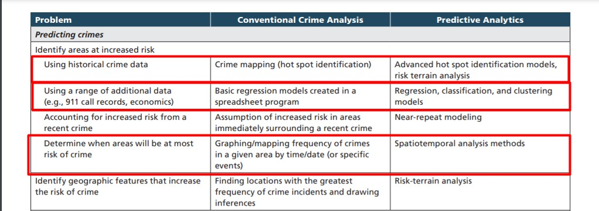
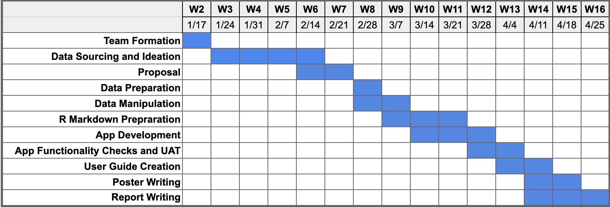
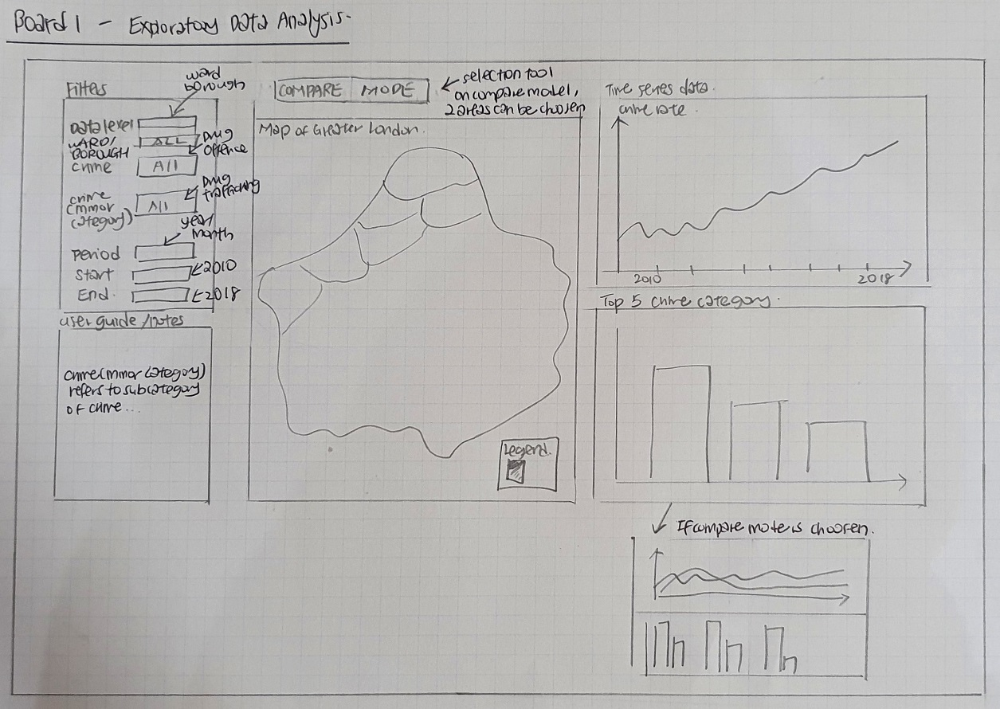
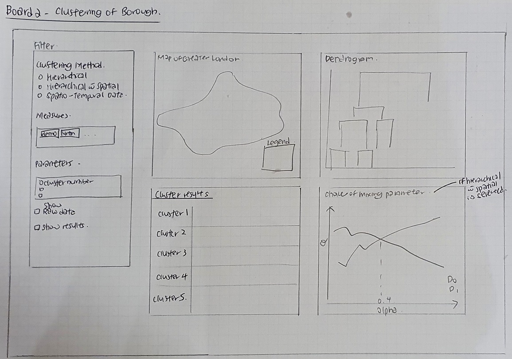
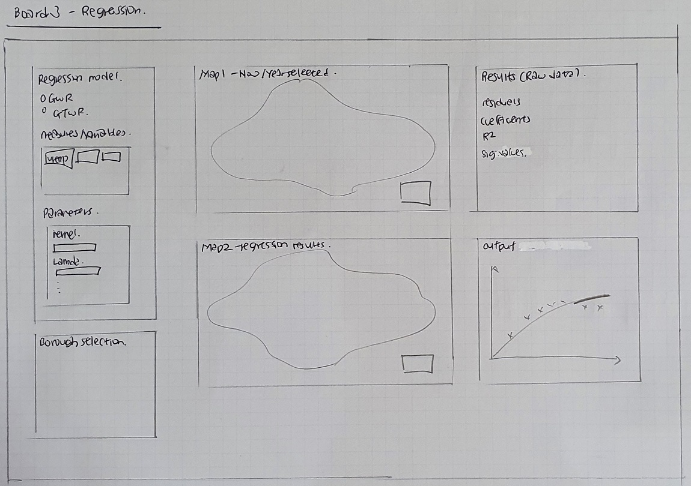

```{r setup, include=FALSE}
knitr::opts_chunk$set(echo = FALSE)
```

## Contents {#top}
- [Executive Summary](#es)
- [Motivation](#mt)
- [Project Objectives](#proj_obj)
- [Datasets](#Data)
- [Proposed Scope and Methodology](#scope)
- [Storyboard & Visualization Features](#Story)
- [Software Tools](#Tools)
- [R-Packages](#Packages)
- [References](#References)
\

## Executive Summary{#es}
[*Back to top*](#top)

Demographic, socio-economic and crime rate data of the Greater London Region, retrieved from the London Datastore, are used in this project. In this project, 3 key analysis will be performed:

1. Exploratory Data Analysis
2. Clustering analysis 
3. Regression Modeling
\pagebreak

## Motivation{#mt}
[*Back to top*](#top)

With the limited police resources and possible adverse impact when crime occurs, analytics on crime has been done as far back as in the 1800s [(Hunt, 2019)](https://nij.ojp.gov/topics/articles/crime-mapping-crime-forecasting-evolution-place-based-policing#a-brief-history). Crime occurrence was found to have spatial patterns, and thus predictive analytics should be possible. However, mixed results were obtained in the research to determine whether predictive policing results to lower crime rates [(Meijer & Wessels, 2019)](https://www.tandfonline.com/doi/pdf/10.1080/01900692.2019.1575664?needAccess=true). Thus, it is more beneficial to use the analytics to determine areas with higher risk of crime and to discover the underlying factors to the increased risk.

Traditionally, crime analysis is done manually or through a spreadsheet program [(RAND Corporation, 2013)](https://www.rand.org/content/dam/rand/pubs/research_briefs/RB9700/RB9735/RAND_RB9735.pdf). This project would give the users an easier way to do the analysis using a web application. 

```{r}

``` 

\pagebreak

## Project Objectives{#proj_obj}
[*Back to top*](#top)

This project aims to deliver an interactive user web application interface, whereby users are able to apply actionable insights based on the 3 key analysis

- Understanding hot spots of crime rate, with a visual map of Greater London
- Clustering of areas based on different techniques
- Forecast possible hot spots based on different regression models
- To provide data-driven insights to inform preventative measures such as warnings and allocation of police force resources and influence ward planning policies 
\

## Datasets{#Data}
[*Back to top*](#top)

A borough includes wards, which is the primary unit of English electoral geography for civil parishes and district councils. There are a total of 32 boroughs in Greater London, excluding the City of London. 

**1. MPS Ward Level Crime (historic: Apr 2010 onward)**

  - Monthly data from Apr 2010 to Dec 2018 
  - Dimensions include: *BoroughName, Wardcode, wardname, major category, minor category*

**2. MPS Ward Level Crime (most recent 24 months)**

  - Monthly data from Apr 2010 to Dec 2018 
  - Dimensions include: *BoroughName, Wardcode, wardname, major category, minor category*

**3. Land Area & Population - Ward**

  - Yearly data from 2011 to 2050 
  - Dimensions include: *BoroughName, Wardcode, wardname*
  - Attributes: *Population, Hectares, Pop Per square km*

**4. Income of Taxpayers**

  - Data every 2 years from 1999 to 2018
  - Dimensions: *Code, Area*
  - Attributes: *Mean of Tax, Medium of Tax*

**5. Economic Activity Rate, Employment Rate and Unemployment Rate by Ethnic Group & Nationality, Borough**

  - Yearly data from 2005 to 2019
  - Dimensions: *Code, Area*
  - Attributes: *Employment rate, Unemployment rate, Economic inactivity rate*

**6. Geographical Map of London (LOAC) SHP data**

**7. Local Authority District Names and Codes**

  - Dimension: *BoroughName, Area Code*
\

## Proposed Scope and Methodology{#scope}
[*Back to top*](#top)

**1. Data cleaning and preparation**

- Datasets should all have consistent depth (ward VS borough) and the same duration
- Using dplyr package, immediate operation and data-manipulation

**2. Choose the right R package to visualize: **

- Based on our project objectives, we came out with storyboards and evaluated different versions of our interactive visualisation application. With our shortlisted storyboard in mind, we explored the R packages required to build the visualisation.
 
**3. Data visualization and Analysis**

-  Exploratory Data Analysis (EDA) 

  - Exploratory Spatial Data Analysis  (ESDA) 
    - Finding spatial hotspots, outliers and anomalies of wards with high crime rate
  - Time series of geo-spatic data 
    - Understanding how crime rates have changed over the years, broken down by wards
  - Clustering of Location Authority District : Finding similar LAD 
    - Hierarchical Clustering (Hcluster)
    - Hierarchical Clustering with Spatial Constraints (GeoCluster)
    - Clustering of Spatio-Temporal Data (STC Model) 
  - Regression: Forecasting of crime rate in each LAD
    - Geographically weighted regression (GWR)
    - Geographically And Temporally Weighted Regression (GTWR)
 
**4. Building of Artifact - Web Application**

- R Markdown development
- Functionality checks

The timeframe for this project is illustrated in the Gantt Chart below

```{r}

``` 

\
## Storyboard & Visualization Features{#Story}
[*Back to top*](#top)

### Board 1  - Exploratory Data Analysis

- To understand crime rate broken down by wards/borough
- To observe the distribution of crimes
- To observe the crime rate over time period

```{r}

``` 

### Board 2 - Clustering Analysis

- To create clustering, based on parameter and clustering methods

```{r}

``` 


### Board 3 - Regression Analysis

- To forecast crime rate, based on parameter and regression models

```{r}

``` 

\

## Software Tools{#Tools} 
[*Back to top*](#top)

[RStudio](https://rstudio.com/)

## R-Packages{#Packages} 
[*Back to top*](#top)

**Data Cleaning**:

* [dplyr](https://cran.r-project.org/web/packages/dplyr/dplyr.pdf) - for data cleaning
* [plyr](https://cran.r-project.org/web/packages/plyr/plyr.pdf) - for data cleaning
* [tidyverse](https://cran.r-project.org/web/packages/tidyverse/tidyverse.pdf) - for data cleaning
* [lubridate](https://cran.r-project.org/web/packages/lubridate/lubridate.pdf) - for working with dates and times

**EDA**:

* [sf](https://cran.r-project.org/web/packages/sf/sf.pdf) - for encoding spatial vector data
* [sp](https://cran.r-project.org/web/packages/sp/sp.pdf) - for encoding spatial vector data
* [ggplot2](https://cran.r-project.org/web/packages/ggplot2/ggplot2.pdf) - for data visualisation
* [choroplethr](https://cran.r-project.org/web/packages/choroplethr/choroplethr.pdf) - for creating choropleth maps
* [tmap](https://cran.r-project.org/web/packages/tmap/tmap.pdf) - for visualization of geospatial data

**Clustering Analysis**:

* [fastcluster](https://cran.r-project.org/web/packages/fastcluster/fastcluster.pdf) - for hierarchical clustering
* [ClustGeo](https://cran.r-project.org/web/packages/ClustGeo/ClustGeo.pdf) - for hierarchical clustering with geographical constraints
* [SpaTimeClus](https://cran.r-project.org/web/packages/SpaTimeClus/SpaTimeClus.pdf) -  for clustering with spatio-temporal data
 
**Regression Analysis**:

* [gstat](https://cran.r-project.org/web/packages/gstat/gstat.pdf) - for interpolating data, spatial and spatio-temporal modelling,  prediction, and simulation
* [spgwr](https://cran.r-project.org/web/packages/spgwr/spgwr.pdf) - for geographically weighted regression
* [GWmodel](https://cran.r-project.org/web/packages/GWmodel/GWmodel.pdf) - for geographically weighted regression

**Web Application**:

* [shiny](https://cran.r-project.org/web/packages/shiny/shiny.pdf) - for creating web application

## References{#References}
[*Back to top*](#top)

- Hunt, J. (2019, July 10). From Crime Mapping to Crime Forecasting: The Evolution of Place-Based Policing. *National Institute of Justice*. Retrieved from [https://nij.ojp.gov/topics/articles/crime-mapping-crime-forecasting-evolution-place-based-policing#a-brief-history](https://nij.ojp.gov/topics/articles/crime-mapping-crime-forecasting-evolution-place-based-policing#a-brief-history)
- Meijer, A., & Wessels, M. (2019, February 12). Predictive Policing: Review of Benefits and
Drawbacks. *International Journal of Public Administration, 42*(12), 1031-1039. doi: [10.1080/01900692.2019.1575664](https://doi.org/10.1080/01900692.2019.1575664)
- RAND Corporation. (2013). Predictive Policing: Forecasting Crime for Law Enforcement. Retrieved from [https://www.rand.org/content/dam/rand/pubs/research_briefs/RB9700/RB9735/RAND_RB9735.pdf](https://www.rand.org/content/dam/rand/pubs/research_briefs/RB9700/RB9735/RAND_RB9735.pdf)

### Data Sources

- [London Datastore](https://data.london.gov.uk/)
  - [Recorded Crime: Geographic Breakdown](https://data.london.gov.uk/dataset/recorded_crime_summary)
  - [London Output Area Classification](https://data.london.gov.uk/dataset/london-area-classification)
  - [Economic Activity Rate, Employment Rate and Unemployment Rate by Ethnic Group & Nationality, Borough](https://data.london.gov.uk/dataset/economic-activity-rate-employment-rate-and-unemployment-rate-ethnic-group-national)
  -[Land Area and Population Density, Ward and Borough](https://data.london.gov.uk/dataset/land-area-and-population-density-ward-and-borough)
  - [Average Income of Tax Payers, Borough](https://data.london.gov.uk/dataset/average-income-tax-payers-borough) 
- [Consumer Data Research Centre](https://data.cdrc.ac.uk/)
- [Office for National Statistics](https://geoportal.statistics.gov.uk/)
  - [Local Authority Districts (December 2016) Names and Codes in the United Kingdom](https://geoportal.statistics.gov.uk/datasets/local-authority-districts-december-2016-names-and-codes-in-the-united-kingdom)
