```{r setup, include=FALSE}
knitr::opts_chunk$set(echo = FALSE)
```

## Contents {#top}
- [1.Overview](#over)
- [2.Critics](#cr)
- [3.Alternative Graphical Representation](#alt)
- [4.Data Visualization Preparation](#data)
- [5.Creating a DashboardProposed Scope and Methodology](#create)
- [6. Major Observations](#major)

## 1.0 Overview {#over}
[*Back to top*](#top)

This post is focusing on the 2 data visualisations found in DataViz Makeover 3 for ISSS608 Visual Analytics and Applications. The tasks for this DataViz Makeover are as followed:

- Critic the graph on its clarity and aesthetics
- Suggest alternative graphical presentation to improve and provide a proposed design
- Design proposed data visualization using Tableau
- Provide Step-by-Step description of data visualization preparation
- Describe three major observations 


The original data visualizations can be found [*here*](https://public.tableau.com/profile/tskam#!/vizhome/South-eastAsiaArmedConflictAnalysis/South-eastAsiaArmedConflictAnalysis) 

Below is a snapshot of the original data visualisations.

```{r}
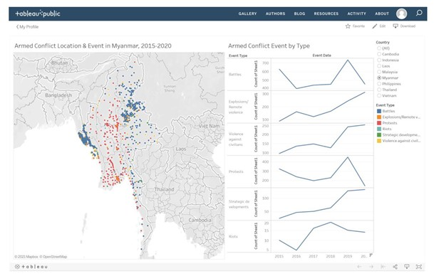
``` 

## 2.0 Critics{#cr}
[*Back to top*](#top)

# 2.1 Clarity

**Inconsistency in y-axis Scale for Line Graph**

The 6 time-series graphs are misleading as all of them are using a different y-axis scale and none of the line graph starts from zero. At the first glance, users might assume that in 2017 and 2018,  riots have spiked in 2017 whereas number of battles is negligible. Only at a closer look, users notice that the y-axis ranges from 5 to 20 as compared to the “Battle” line graph whereby the range is at 400 to 700. 

```{r}
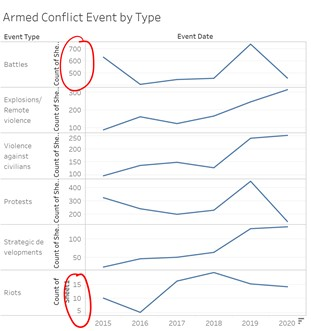
``` 

**Missing Markers in Line Graphs, with Inconsistent x-axis Label**

The x-axis label “Event Date” might mislead users to assume that the line graphs are plotted with data points by date. Hence, based on the graph, it seems as though there are conflict events throughout the year. Based on the x-axis, the data points and number of conflict events are aggregated by year which can be easily overlooked by users. Data markers represent a data value and provide more clarity to the users. 

```{r}
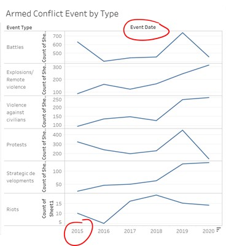
``` 

**Broken Line Graphs Due to Null Values**

While filtering by country, there are certain years whereby a country does not have a conflict event under a specific event type. Hence, the line on the graph will be broken, making it hard for users to visualize and follow the trend. 

```{r}
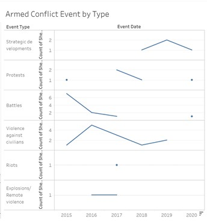
``` 

# 2.2 Aesthetics

**Overlapping Data Points on Geographical Map**

There seems to be high frequency of battles at certain area of Myanmar. However, as the data points are filled with no transparency, it is hard to show the circle marks clearly as they overlap. Events that happen at the same location are represented by 2 overlapping marks, instead of increasing the size of the marks to show quantity.

```{r}
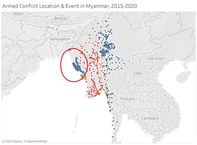
``` 

**Data Ink Issues with Line Graphs**

In the 6 time-series graphs, the y-axis label “Count of Sheet1” is confusing and redundant. Moreover, the y-axis labels are emphasized unnecessary by putting them in bold.  The axis label is not required, since it can be made known to users by revising the title to “Number of Armed Conflict Event by Type”. On the contrary, important details and data-ink such as the event type, the y-axis and x-axis are in light grey and are not given emphasized. Lastly, the x-axis has a “filter” symbol next to “2020” which should be omitted too.


```{r}
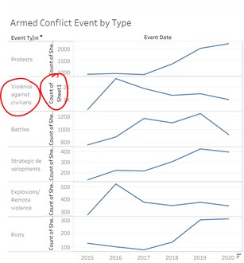
``` 

**Using the Same Color for All Line Graphs**

With the legend next to the 6-line graphs, the visualizations can be clearer by keeping the colors consistent. With “Protests” represented by red, the line graph showing the number of protests should be in red as well.  

# 2.3 Interactivity

**Lack of Temporal Representation on Geographical Map**

The map shows an aggregated view on the geospatial distribution of armed conflict event in 2015 to 2020. By selecting an event type of a certain year on the line graph, the map does not filter to show the corresponding location. A user is unable to further explore how the type and number of events have changed over the 5 years without the connection between temporal and geospatial variables. 


```{r}
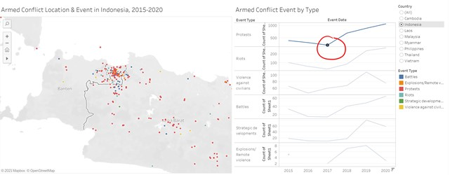
``` 

**Lack of Additional Information on Tooltip**

In the geographical map, when a user hovers over a data marker, it shows latitude, longitude and event id city which do not provide useful insights to a user. A user will not know what state the event is in based off these additional details. The event type – Battle is redundant since the user can already identity via the color. 

```{r}
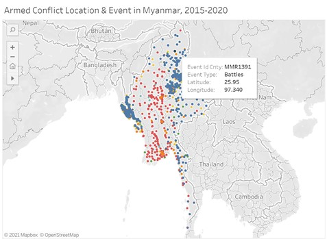
``` 

The tooltip does not help users draw meaningful insights in understanding the type of conflict events associated with different states or sub regions. To focus onto certain hot spots with high volume of events, users are required to zoom into the map to get the state name. The user then must zoom out to compare the differences between states.

```{r}
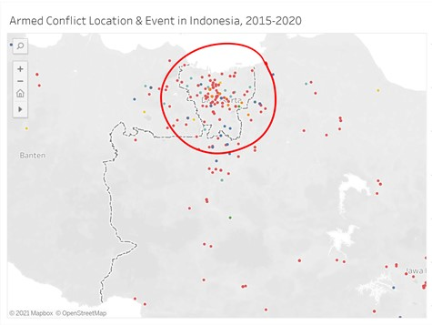
``` 

Similarly, on the line graph, the tooltip is reflecting information on what the user already knew and does not value add or provide additional references. 

```{r}
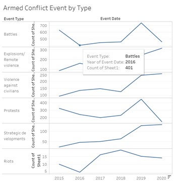
``` 

**Confusing Sorting Options**

This visualization provides users 4 options to sort the line graphs. However, the option of “data source order” does not make sense whereas under “field” and “nested”, there is no context explaining what CNT(Sheet1) is referring to

```{r}
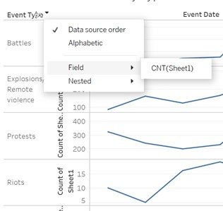
``` 

## 3.0 Alternative Graphical Representation {#alt}
[*Back to top*](#top)

# 3.1 Suggested Improvements

**Revision of Line Graph**

*Issues to Tackle: i) Inconsistency in y-axis Scale for Line Graph, ii) Using the Same Color for All Line Graphs, iii) Confusing Sorting Options*

For the new Line Graph, it will combine the 6 line graphs into 1 single line graph, where each line will represent 1 event type and differentiated by color. The color legend used will be kept consistent in both the map and the line graph. Hence, it allows users to compare the event types across time easily without any distortion of graphs due to different y-axis scale. There will be no sorting function since the line graph will be arranged by year.

**Revision of data-ink on Line Graph**

*Issues to Tackle: i) Missing Markers in Line Graphs, with Inconsistent x-axis Label, ii) Broken Line Graphs Due to Null Values , iii) Data Ink Issues with Line Graphs*

The x-axis "Event Date" will be removed, since it is obvious that x-axis is referring to years. Additional markers on line graph will be added to show more clarity that the data points are marked based on year. Y-axis label will be revised from "Count from sheet 1" to "Number of Events". Both axis will be emphasised.

**Revised Geographical Map with Proportionate Symbols**

*Issues to Tackle: Overlapping Data Points on Geographical Map*

Circle marks will be given transparency instead of being opaque and their size will represent the number of events at the same location. This will allow users to have clarity of the geo spatial distribution of events and the key hot spots with the highest number of conflict events

**Additional Filters on Dashboards**

*Issues to Tackle: Lack of Temporal Representation on Geographical Map*

On top the country selection, the parameter – Year will be added to allow users to filter. In additional, selection on line graph based on a particular marker will be set as a filter to provide a filtered view of the events of a particular year on the geographical maap. This allows users to understand the locations of events at a specific year.

**New Tooltip for Geographical Map**

*Issues to Tackle: Lack of Additional Information on Tooltip*

Instead of showing event type, longitude, latitude and event id city, the following information will be shown to provide additional context and information to users: i) Sub Area, ii)	Sub event type, iii) Fatalities, iv) 	Notes.

**New Tooltip for Line Graph**

*Issues to Tackle: Lack of Additional Information on Tooltip*

Instead of event type, year and count, the tooltip aims to show the breakdown of events by sub event type.

# 3.2 Alternative Graphical Representation

The draft for DataViz Makeover can be seen below, where the 2 key visualizations are i) a Geographical Map and ii) a line Graph.

```{r}
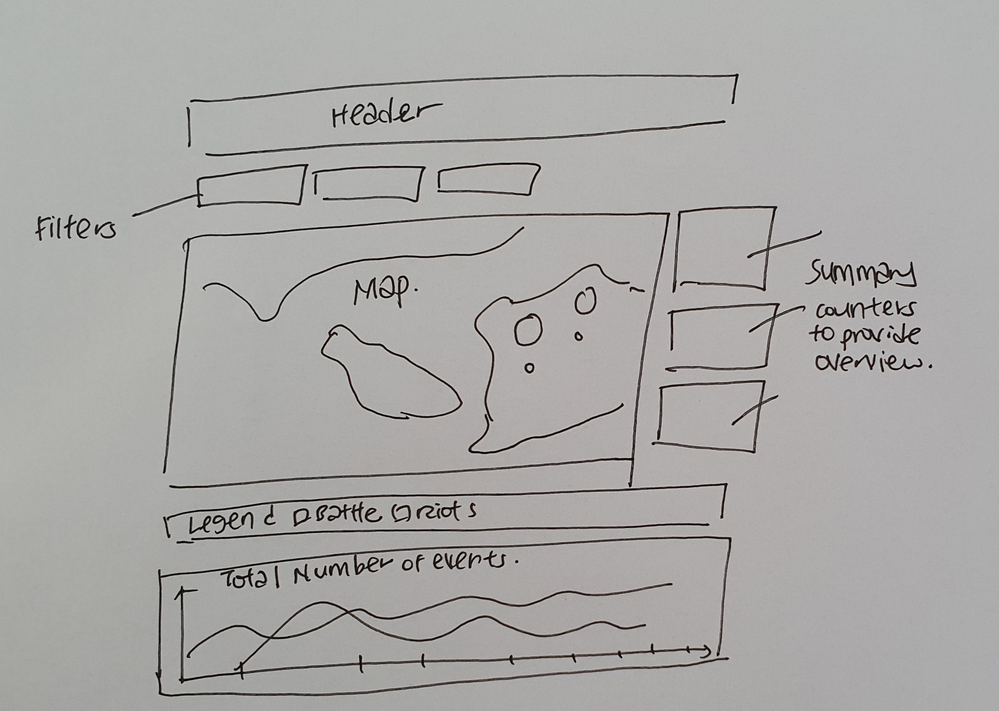
``` 

The proposed data visualization is designed using Tableau and can be found [*here*](https://public.tableau.com/profile/mei.siew.toh#!/vizhome/DataVizMakeover3_16162284814670/ConflictEvents)

## 4.0 Data Visualization Preparation {#data}
[*Back to top*](#top)

# 4.1 Data Preparation

The dataset used is obtained from The Armed Conflict Location & Event Data Project (ACLED) and available via https://acleddata.com/#/dashboard. There are a total of 9 datasets available and the dataset used is on Southeast Asia.

The dataset is imported into Tableau for further data visualization preparation. Each column is examined to ensure that the data type is selected correctly on Tableau.

```{r}
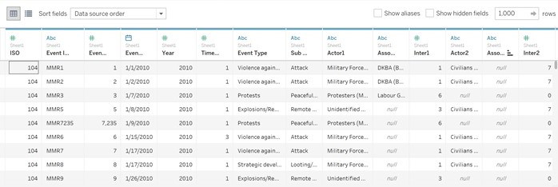
``` 

The following column – Year has the wrong data type indicated and manually changed from number to date. In addition, the following columns are not required in this data visualisation exercise and hence hidden: *ISO, EVENT_ID_CNTY, EVENT_ID_NO_CNTY, ASSOC_ACTOR_1, ASSOC_ACTOR_2, INTER1, INTER2, INTERACTION, ADMIN2. ADMIN3, TIMESTAMP*

In total, 18 columns are left to be used for the next steps in data visulisation 

# 4.2 Plotting a Line Graph

A new calculated field [Number of Event] is created with a value 1. This field will count of the number of records in the dataset. For 1 record in the dataset, it represents 1 event.

```{r}
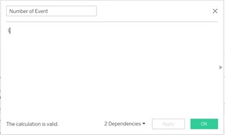
``` 

[Year] is placed on the Columns shelf and [Number of Event] is placed on the rows shelf. 

```{r}
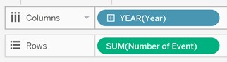
``` 

Next, [Event Type] is pulled to details and colors.

```{r}
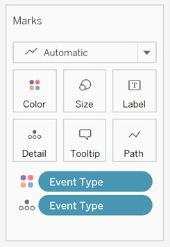
``` 

For some countries such as Laos, there can be no events on a certain year for a certain event type and therefore NULL values. For instance, there are no battles in 2010, 2011 , 2013 and 2014.  Hence, the path will be broken and hard for users to read and trace. 

```{r}
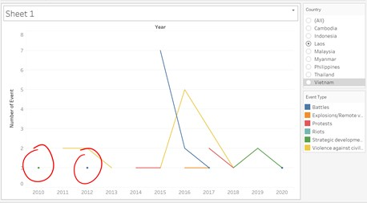
``` 

Hence, a calculated field [Total Events] is created to change NULL values to zero instead

```{r}
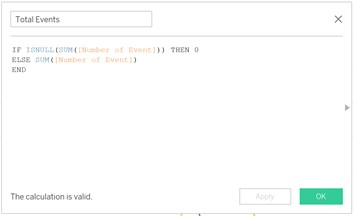
``` 

[Number of Event] is then replaced by [Total Events]  in the rows shelf , reflecting NULL events as zero so that the paths are not broken

```{r}
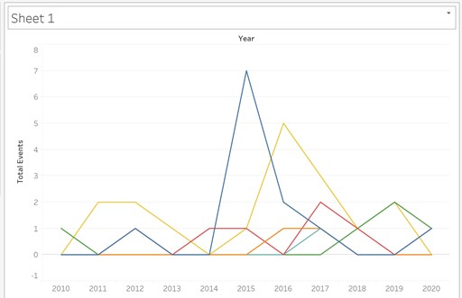
``` 

**Aesthetic Adjustments on Line Graph**

The y-axis will be fixed to start from zero and the y-axis label is changed to “Number of Events”. As the x-axis and y-axis change based on the country filter, the “Fit Width” option is selected to fix the width of the line graph

```{r}
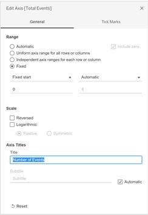
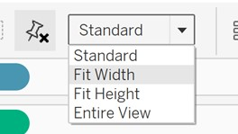
``` 

For the x-axis, the “Rotate Label” option is chosen. The x-axis label “Year” is removed as it is self-expantory based on the values

```{r}
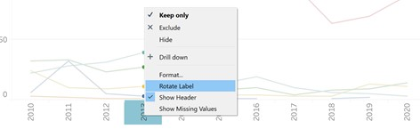
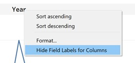
``` 

Lastly, the size of the path is reduced and mark labels are shown, with mark labels color as 0% opacity. 

```{r}
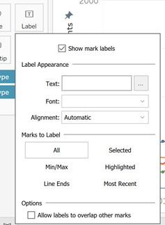
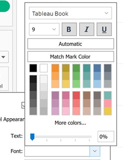
``` 

The final data visualisation now looks clearer with the data points marked. 

```{r}
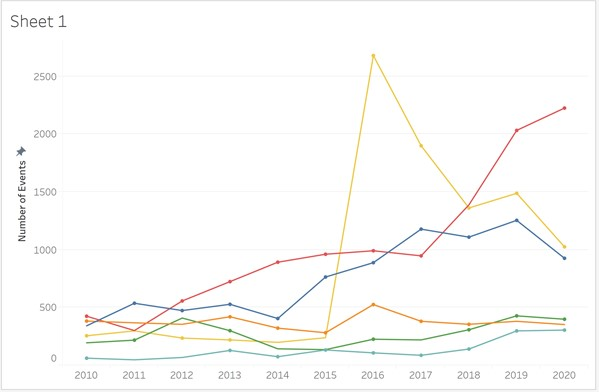
``` 

# 4.3 Creating a Tooltip for Line Graph - Breakdown of Sub Events

[Sub Event Type ] is placed on the rows shelf and [Number of Event] is placed on the columns shelf. In this case, [Total Event] is not used as we are not concerned with NULL values of sub event type. 

```{r}
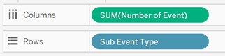
``` 

The columns is sorted by field in descending order based on sum of number of events. The title of this sheet is renamed as “Breakdown of sub event types”. 

```{r}
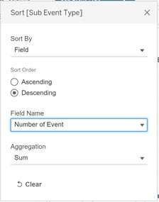
``` 

Lastly, [Event Type] is placed at the row shelf to provide an overview of the breakdown. Upon examination, for events such as “Battles” “Explosions”, ”Protest” “Violence against civilians”, most events falls under 1 sub event type. Hence, a bar graph is not a suitable data visualisation since it will be cut off in a tooltip.

```{r}
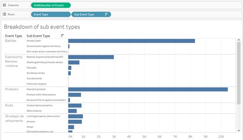
``` 

Pie charts are not feasible when applied on events such as “Riots” as the distribution among sub events is fairly even. For the event ”Strategic Development”, it consists 8 sub types, hence pie charts are not ideal as well

```{r}
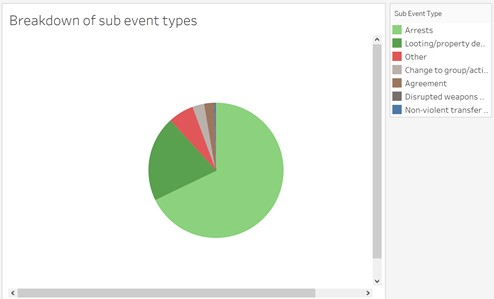
``` 

Hence, a data table is choosen instead. [Event Type] and [Number of Event] are removed from the row and colum shelf. [Number of Event] is placed at details

```{r}
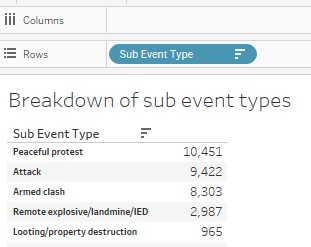
``` 

To add the table into Selecting Tooltip option, the sheet – Sub Event Type is chosen and saved.

```{r}
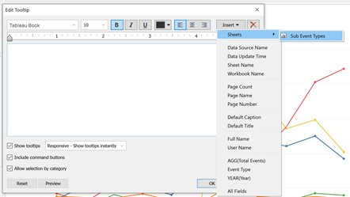
``` 

The dynamic field [Event Type] is added in to provide clarity.

```{r}
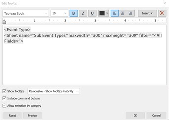
``` 

With the updated tooltip, users are able to breakdown the events into sub event types, providing additonal insights. For instead, for Indonesia, though there was a spike in protests in 2018, it was largely peaceful protests.

```{r}
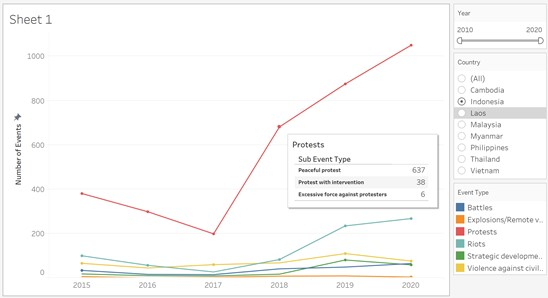
``` 

# 4.4 Creating a Geographical Map

[Longtitude] is placed at the column shelf whereby [Latitude] is placed at the row shelf. As there is no location name given to each pair of  longtitude and latitude, a new calculated field [Actual Location] is created by concentating the latitude and longtitude together. [ Actual Location] is then placed at the detail level. [Event Type] is placed on color. [Number of Event] is placed at size. 

```{r}
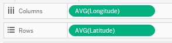
``` 

As there is no location name given to each pair of  longtitude and latitude, a new calculated field [Actual Location] is created by concentating the latitude and longitude together. [Actual Location] is then placed at the detail level. [Event Type] is placed on color. [Number of Event] is placed at size. 

```{r}
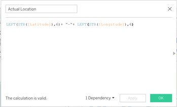
``` 

[Country] is pulled to filters and exposed for a user to select. A single value list type is selected. 

```{r}
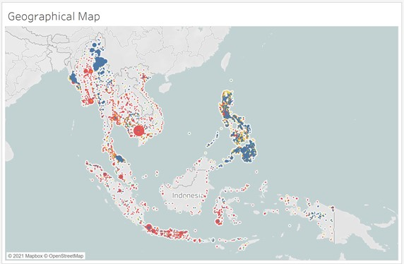
``` 

In addition, [Year] is also pulled into filters and exposed, with “Year” selected and a continuous data type. The range of value option is selected. The filter is renamed to “Year” instead of Year(Year).

```{r}
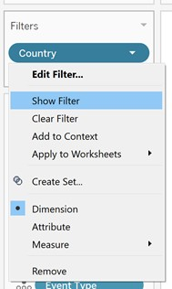
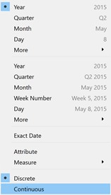
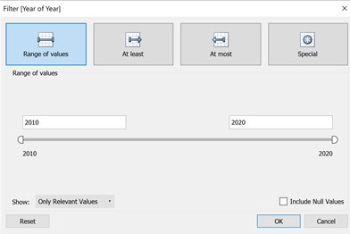
``` 

With [Number of Events] pulled to size, closer examination shows that there is a wide range of number of event. While looking at the map, circle mark will be small if the specific location only has 1 conflict event when compared to locations with high number of events. As seen in the distribution of events against location, it is a similar 20-80 distribution whereby 80% of events happen in 20% of location.

```{r}
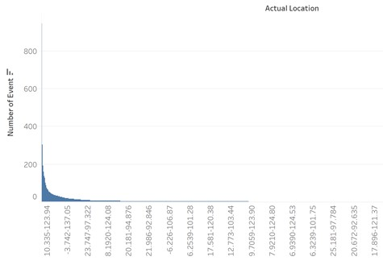
``` 

Hence, a filter is created to allow users filter only the top N% of locations based on the number of events.

Firstly, a parameter [Percentile] is created. A range of values from 10 to 100 will allow users to choose in step size of 10 i.e. top 10% percentile, top 20% percentile.  This parameter is exposed.

```{r}
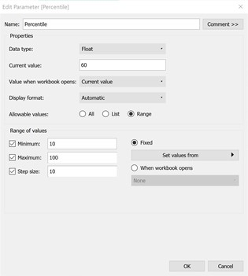
``` 

It is possible that users will want to look at the bottom N% locations. Hence, a second paramter [Top/bottom] is created. This parameter is exposed

```{r}
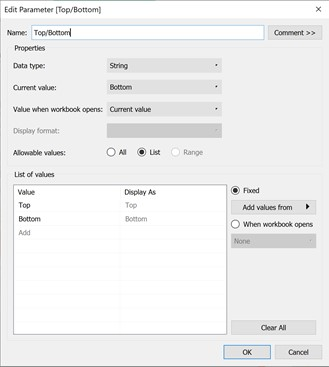
``` 

Next, a new calculated field [N% Location] is created. This field will be used as a filter so that only the top or bottom N% locations are shown in the geographical map. Using Rank, the results are computed along [Actual Location].

```{r}
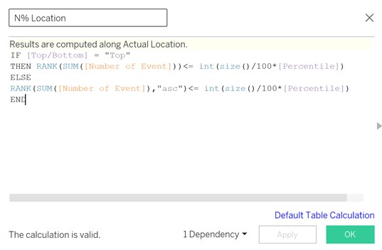
``` 

The new calculated field is then pulled to Filters and “True” is selected.

```{r}
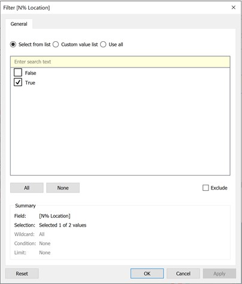
``` 

Based on the objective of users, selecting bottom 10% percentile or top 10% percentile will provide a different geospatial view.

```{r}
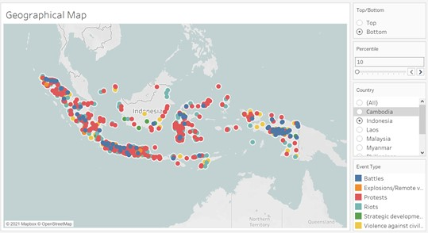
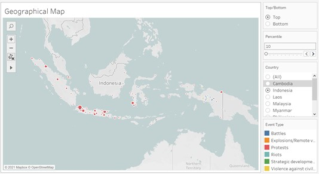
``` 

**Aesthetic Adjustments on Geographical Map**

The opacity of the marks are reduced to 55% so that overlapping marks are visible.
While filtering to a certain country, it will be helpful for the geographical map to be automatically zoomed into the filtered country. Hence, [Longitude] and [Latitude] are both added to filters, with the option of showing ”Only Relevant Values”. 

```{r}
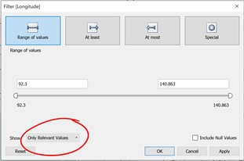
``` 

Lastly, the title of the geographical map is revised to be dynamic, showning the following: Country Filtered, Year Filtered, Top X or Bottom X of total events selected.

Users have the option to choose 100 percentile, and in this case, it will refer to all locations selected. A new calculated field [Header] is created to show “All Locations” in the title, instead of Top 100 Percentile and Bottom 100 Percentile. The new calculated field is calculated as shown below

```{r}
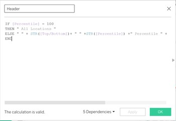
``` 

[Header] is then pulled onto [Label] and selected while creating the title of this visualization.

```{r}
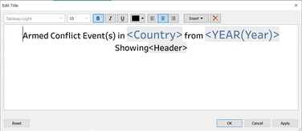
``` 

# 4.5 Creating a Tooltip for Line Graph - Additional Information.

The following attributes are pulled to Tooltip
i)	Event Date
ii)	Sub event type
iii)	Notes
iv)	Fatalities
v)	Admin1

The default tooltip is wordy and revised to be more readable. 

```{r}

``` 

[Longitude], [Latitude] and [Actual Location] are removed as this does not provide additional input for the user. The first revision of the Tooltip is shown below, mainly to provide a comprehensive summary of the events happening at the location.

```{r}

``` 

For some location whereby there are more than 1 event, there will be no notes available. In addition, if there are more than 1 even sub type, it will be left with *, which might not be useful for the users. 

```{r}

``` 

For notes, a new calculated field [Notes Revised] is created. This will provide additional annotation on why the summary did not appear as expected.

```{r}

``` 

For sub event type, the [Sub Event Types] worksheet is cloned and field label for rows is hidden. Both the new calculated field [Notes Revised] and the new worksheet [Sub Event Types (2)] is added into the tooltip. 

```{r}
knitr::include_graphics("images/54-tooltip.jpg")
``` 

The tooltip now shows additional information that could be helpful to the user. 

```{r}

``` 

## 5.0 Creating a Dashboard {#create}
[*Back to top*](#top)

Firstly, both the geographical map and the line graph are selected and pulled into the dashboard. The 2 filters in geographical map – [year] and [Country] are applied to all using related data sources. 

```{r}

``` 

The 2 filters – [Year] and [Country] and 2 Paramter [Top/Bottom] and [Percentile] are placed at the top, followed by the map and then the line graph. Only 1 legend representing event types is placed in between the 2 visualisations and the other removed, since both visualizations share the same legend and color scale. 

The [Number of Events] size legend is placed next  to the geographical map.
To create interactivity between both visualizations, the line graph is also used as a filter. Hence, a user is able to the geo-spatial distribution of events in a given year and a given event type. 

```{r}

``` 

# 5.1 Adding Summary Counters
3 additional worksheets are created to serve as Counters which summarize the entire dashboard.The 3 summary required are i)Total Events, ii) Total Fatalities, iii) Total Location

In the 1st worksheet, [Number of Events] is pulled to text, showing the SUM(Number of Events). For the 2nd worksheet, it is a duplicate of worksheet  and[Number of Events] is replaced by [Fatalities]

The 3rd worksheet has [Actual Location] in replace of [Number of Events]. CNTD[Actual Location] is selected to show the total number of unique event locations. 

The 3 counters are placed at the right side of the geographical map on the dashboard.

# 5.2 Aesthetic Adjustments on Dashboard

Formatting is done so that the customisable filters and parameters stand out and easily accessible for users. For the map, the color used for “Riots” is very similar to the map color, hence the map is changed to a grey scale instead. 

```{r}

``` 

Lastly, the color used in the fonts and headers is all standardised.

```{r}

``` 

## 6.0 Major Observations {#major}
[*Back to top*](#top)

**A Spike in Violence Against Civilians in 2016**

Based on the line graph, there is a spike in violence against of civilians in 2016. By selecting and filtering this data point on the graph, it shows the geospatial distribution of all the events in 2016. Philippines is the hot spot in terms of number of armed conflict events pertaining to violence against civilians. 

```{r}

``` 

Filtering further by showing only the top 10% of locations in Phillipines, most events are concentrated at Metropoliaan Manila. Interesting, the key city area is the hot spot for violence against civilians, despite the higher affluence community.

```{r}

``` 

**Protests as the key type of conflict event in Indonesia**

Based on the top 10% of locations in Indonesia, protests are mainly held at these hot spots. Most of the protests are peaceful and have no fatalities involved. Authorities might want to understand the reason behind the high voume of peaceful protests and policy making efforts to resolve issues by the citizens. 

```{r}


``` 

**Spike in Battles in Laos in 2015**

In the last 10 years, Laos has a total of 44 events and 36 fatalities. The 7 battles contribute to 16% of its total armed conflict events. 

```{r}

``` 

After selecting only the data point of battles in 2015, the geographical map shows 2 areas where the battles are at. By hovering over the map, 1 armed clash happened in Luang Prabang, with 1 fatalities. The summary in the tooltip also provided additional information on this event. This is a one-off event.

```{r}

``` 

On the other hand, the remaining 6 events took place at Xaysomboun. This shows that this location is a hot spot for armed clash, unlike Luang Prabang. Authorities might want to add security around this particular location and look in depth into the reasons.

```{r}

``` 


