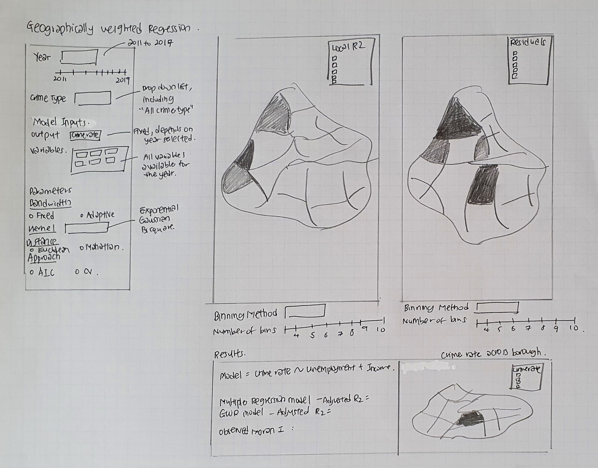

```{r setup, include=FALSE}
knitr::opts_chunk$set(echo = FALSE)
```

# 1.0 Introduction

With the limited police resources and possible adverse impact when crime occurs, analytics on crime has been done as far back as in the 1800s (Hunt, 2019). Crime occurrence was found to have spatial patterns, and thus predictive analytics should be possible.Traditionally, crime analysis is done manually or through a spreadsheet program (RAND Corporation, 2013). This project would give the users an easier way to do the analysis using a web application.

## 1.1 Scope of this report

This report is a sub-module of the bigger Shiny-based Visual Analytics Application (Shiny-VAA) project under ISSS608 Visual Analytics. 

For this report, it provides the details of using Geographically weighted regression (GWR) to explore spatial heterogeneity in the relationship between variables. Instead of using least square linear regression models, GWR is done to explore whether the relationship between the independent variables (Population Characteristics) and the outcome variable (Crime Rate) is changing geographically.

A borough includes wards, which is the primary unit of English electoral geography for civil parishes and district councils. There are a total of 32 boroughs in Greater London, excluding the City of London. GWR will be done on the borough level as most of the independent variables are available on the aggregated borough level.

## 1.2 Literature Review

The most common method to displaying regression data with reference to geo-spatial weighted regression for a SpatialPolgyon dataframe will be a choropleth map showing residuals. (Medina, J. & Solymosi, R., 2019)

```{r echo=FALSE}
knitr::include_graphics("images/litreview.jpg")
```

However, other than using residuals to fill up the choropleth map, these are the other values that are represented in the choropleth to visualize the output of a GWR model, which can be useful to the users as well. 

1. Standard deviation
2. Local R2
3. Coefficient Standard Error
4. Observed and Predicted Y Values 
5. Input variable's variable coefficient and standard errors

These are part of the output GW.diagnostic provided by the GWmodel package. 

Depending on the user's requirements, the values will provide an insight of its geo-spatial differences. For instance, using local R2 in a choropleth map can show how strong the model is across polygons i.e. how many percentage of the output variable can be explained by the input variables in the model.

## 1.3 Datasets Used

The datasets are taken from the London Datastore https://data.london.gov.uk/ and are as followed

1. MPS Ward Level Crime Data 

2. Land Area and Population

3. Income of Taxpayers

4. Economic Activity, Employment Rate and Unemployment Rate by Ethnic Group and Nationality

## 1.4 Library Used 

The R packages used for this assignment are:

**1. For data Cleaning and data wrangling**: *tidyverse*, including dplyr, *lubridate*, *readxl*

**2. Choropleth Mapping**: *tmap* , *leaflet*

**3. For interactivity**: *plotly*

**4. For Geo-Spatial Statistical Modeling**: *sf* (Spatial data is required for GWR) , *GWmodel*, *spgwr*, *spdep* (to test for spatial correlation)

# 2.0 Data Preparation

## 2.1 Load Library

The list of packages required for this report is loaded into Rstudio, as seen in the code chunk below.

```{r echo=TRUE, message=FALSE, warning=FALSE}
packages = c("tidyverse","lubridate", "readxl", "sf","tmap","leaflet", "plotly",
             "spgwr","GWmodel","corrplot", "spdep")
for (p in packages){
  if (!require(p,character.only = T)){
    install.packages(p)
    }
  library(p,character.only = T)
}
```

## 2.2 Data Preparation of Crime Data

**2.2.1 Loading Data set into R**

The MPS Ward level crime data has been cleaned up by one of the group members - Hui Yong, where the data has been aggregated by borough level. The crime type classification differs in 2019 as compared to previous years. For instance, "Arson and Criminal Damage"and "Drug Offenses" are only available in 2019. Hence, the crime type used in 2019 are renamed to follow the same crime type classification used in 2010 to 2018.

```{r echo=TRUE, message=FALSE, warning=FALSE}
borough_crime <- read_csv("data/Crime_2010_2019.csv")
```

```{r echo=TRUE}
glimpse(borough_crime)
```

**2.2.2 Data Wrangling**

The headers are renamed: MajorText refers to the type of crime whereas count_by_borough refers to the number of crime committed for each crime type. The data for year 2010 is incomplete for the year as it only started in April, hence filtered out.

Note: There is a new crime type - Public Order Offences in Year 2019. It is assumed that some crimes are re-categorized into this crime type and hence "Public Order Offences" is not eliminated in this project. 

```{r echo=TRUE}
borough_crime <- borough_crime %>%
  rename(CrimeType = MajorText, Crime_No = count_by_borough) %>%
  select(Borough,CrimeType,Date,Crime_No) %>%
  filter(Date > as.Date("2010-12-12"))
```

The data is then pivoted to have each column representing the number of crime for each month. Any data entry with NA values will be replaced with the value 0. 

```{r echo=TRUE}
borough_crime_month <- borough_crime %>%
  group_by(Borough,CrimeType) %>%
  spread(Date,Crime_No) %>%
  ungroup()

borough_crime_month[is.na(borough_crime_month)] <- 0 
```

The data is then grouped by year. Crime rate will be calculated as total number of crime/population. As population data is only available annually, the total number of crime is aggregated on the yearly level. 

```{r echo=TRUE}
borough_crime_year <- borough_crime_month
borough_crime_year$Y2011 <- as.numeric(apply(borough_crime_year[,3:14], 1, sum))
borough_crime_year$Y2012 <- as.numeric(apply(borough_crime_year[,15:26], 1, sum))
borough_crime_year$Y2013 <- as.numeric(apply(borough_crime_year[,27:38], 1, sum))
borough_crime_year$Y2014 <- as.numeric(apply(borough_crime_year[,39:50], 1, sum))
borough_crime_year$Y2015 <- as.numeric(apply(borough_crime_year[,51:62], 1, sum))
borough_crime_year$Y2016 <- as.numeric(apply(borough_crime_year[,63:74], 1, sum))
borough_crime_year$Y2017 <- as.numeric(apply(borough_crime_year[,75:86], 1, sum))
borough_crime_year$Y2018 <- as.numeric(apply(borough_crime_year[,87:98], 1, sum))
borough_crime_year$Y2019 <- as.numeric(apply(borough_crime_year[,99:110], 1, sum))

borough_crime_year <- borough_crime_year  %>%
  select(Borough, CrimeType, Y2011:Y2019)
```

## 2.3 Visualisation of Crime Data By Crime Type

A simple exploratory data analysis is done to understand the distribution of number of crime by crime type across the 32 borough.

The data is pivoted to include "Year" as a variable. 

```{r echo=TRUE, message=FALSE, warning=FALSE}
UK_CrimeType <- borough_crime_year%>%
  rename(`2011`= Y2011,
         `2012`= Y2012,
         `2013`= Y2013,
         `2014`= Y2014,
         `2015`= Y2015,
         `2016`= Y2016,
         `2017`= Y2017,
         `2018`= Y2018,
         `2019`= Y2019,
  ) %>%
  gather(Year, Crime_No,`2011`:`2019`)

head(UK_CrimeType)
```

The code chunk below utilises facet_wrap to generate a summary of 9 crime types over the year 2010 to 2019. In the visualisation below, the crime type - theft and handling shows some outliers in certain boroughs and the volume of theft and handline is higher than the rest of the crime type.

As the facets use standardized axis value, it is hard to visualise the distribution of crime for the other 8 offences as they are all below 20,000 mark.

```{r echo=TRUE}
bp_crime <- ggplot(data=UK_CrimeType, 
                   aes(x=Year, y= Crime_No)) + 
  labs(title = "Distribution of Number of Crime By Crime Type Over Year", 
       x = "Year", y = "Number of Crime") + 
  geom_boxplot(alpha=0.5) + 
  facet_wrap(~CrimeType,ncol = 3) + 
  theme(axis.text.x = element_text(angle = 90, size=7), 
        strip.text.x = element_text(size=7))

bp_crime
```

The code chunk below generates another grid, excluding Theft and Handling.

```{r echo=TRUE}
UK_CrimeType_ExTheft <- UK_CrimeType%>%
  filter(CrimeType != "Theft and Handling")

bp_crime_extheft <- ggplot(data=UK_CrimeType_ExTheft, aes(x=Year, y= Crime_No)) + 
  labs(title = "Distribution of Number of Crime By Crime Type Over Year", 
       x = "Year", y = "Number of Crime")+ 
  geom_boxplot(alpha=0.5) + 
  facet_wrap(~CrimeType,ncol = 3) + 
  theme(axis.text.x = element_text(angle = 90, size=7), 
        strip.text.x = element_text(size=7))

bp_crime_extheft
```

The code chunk below generates another dot plot on Theft and Handling. For better interactivity, ggploty is used so that users are able to hover over the data points to obtain more information the outliers, in this case: the borough.

```{r echo=TRUE}
UK_CrimeType_Theft <- UK_CrimeType%>%
  filter(CrimeType == "Theft and Handling")

bp_crime_theft <- ggplot(data=UK_CrimeType_Theft, 
                         aes(x=Year, y= Crime_No, text = Borough)) +
  labs(title = "Distribution of Theft Crime Over Year", 
       x = "Year", y = "Number of Crime") + 
  geom_point(alpha=0.3, position = position_jitter(0.1)) 

ggplotly(bp_crime_theft,tooltip = c("text"))
```

As seen in the dot plot, Westminster has exceptionally high number of theft and handling crime as compared to the other borough. In the next section, crime rate will be calculated to provide more accurate comparison across borough. 

The code chunk below shows that in this assignment, Theft and Handling is filtered out for further analysis.

```{r echo=TRUE}
crime_theft <- borough_crime_year %>%
  filter(CrimeType == "Theft and Handling")
```

## 2.4 Data Preparation of Population

### 2.4.1 Loading Dataset into R

```{r echo=TRUE}
pop <- read_csv("data/housing-density-ward.csv")
head(pop,5)
```

### 2.4.2 Data Wrangling

The code chunk below shows the aggregation of population data by borough level, with only year 2011 to 2019 being filtered out. The population density of each borough is re-calculated. The data is then pivoted by Year.

```{r echo=TRUE, warning=FALSE}
pop_borough <- pop %>%
  select("Borough", "Year","Population","Square_Kilometres") %>%
  group_by(Borough,Year) %>%
  summarise(across(where(is.numeric), list(sum = sum))) %>%
  filter(Year < 2020) %>%
  rename(Pop = Population_sum) %>%
  rename(Square_Km = Square_Kilometres_sum)

pop_borough_year <- pop_borough %>%
  spread(Year,Pop)
```

The population density is calculated as well and the columns are renamed accordingly

```{r echo=TRUE}
pop_borough_year$Pop_sqkm_2011 = pop_borough_year$`2011` / pop_borough_year$Square_Km
pop_borough_year$Pop_sqkm_2012 = pop_borough_year$`2012` / pop_borough_year$Square_Km
pop_borough_year$Pop_sqkm_2013 = pop_borough_year$`2013` / pop_borough_year$Square_Km
pop_borough_year$Pop_sqkm_2014 = pop_borough_year$`2014` / pop_borough_year$Square_Km
pop_borough_year$Pop_sqkm_2015 = pop_borough_year$`2015` / pop_borough_year$Square_Km
pop_borough_year$Pop_sqkm_2016 = pop_borough_year$`2016` / pop_borough_year$Square_Km
pop_borough_year$Pop_sqkm_2017 = pop_borough_year$`2017` / pop_borough_year$Square_Km
pop_borough_year$Pop_sqkm_2018 = pop_borough_year$`2018` / pop_borough_year$Square_Km
pop_borough_year$Pop_sqkm_2019 = pop_borough_year$`2019` / pop_borough_year$Square_Km

pop_borough_year <- pop_borough_year %>%
  rename(Pop_2011 = `2011`,
         Pop_2012 = `2012`,
         Pop_2013 = `2013`,
         Pop_2014 = `2014`,
         Pop_2015 = `2015`,
         Pop_2016 = `2016`,
         Pop_2017 = `2017`,
         Pop_2018 = `2018`,
         Pop_2019 = `2019`,
         )
```

## 2.5 Data Preparation of Crime Rate 

### 2.5.1 Combining yearly crime data and popluation data together

The code chunk below combines both theft crime data and population data

```{r echo=TRUE}
UK_data <- merge(crime_theft,pop_borough_year,by.x="Borough",by.y= "Borough") 
```

### 2.5.2 Calculating Crime Rate

The code chunk shows the calculation of crime rate, using the calcuation: number of crime divided by population size. This will allow a fair comparison across boroughs with different population size.

```{r echo=TRUE}
UK_data$Crime_2011 = UK_data$`Y2011` / UK_data$Pop_2011 *100
UK_data$Crime_2012 = UK_data$`Y2012` / UK_data$Pop_2012 *100
UK_data$Crime_2013 = UK_data$`Y2013` / UK_data$Pop_2013 *100
UK_data$Crime_2014 = UK_data$`Y2014` / UK_data$Pop_2014 *100
UK_data$Crime_2015 = UK_data$`Y2015` / UK_data$Pop_2015 *100
UK_data$Crime_2016 = UK_data$`Y2016` / UK_data$Pop_2016 *100
UK_data$Crime_2017 = UK_data$`Y2017` / UK_data$Pop_2017 *100
UK_data$Crime_2018 = UK_data$`Y2018` / UK_data$Pop_2018 *100
UK_data$Crime_2019 = UK_data$`Y2019` / UK_data$Pop_2019 *100 

UK_data <- UK_data %>%
  select(-Y2011:-Y2019)
```

## 2.6 Data Preparation of Social-Economic Factors

### 2.6.1 Population Density Data
Population density is calculated earlier in section 2.3 while calculating total population per borough.

### 2.6.2 Income Data

**Loading Dataset into R**

The dataset below provides population data, median income and mean income from 1999 to 2017. The borough level data are extracted and city of London is excluded. Only 2011 to 2017 income data are extracted for this project. 

```{r echo=TRUE}
income <- read_xlsx("data/income-of-tax-payers.xlsx", sheet = "Total Income") %>%
  select (1:2,36:56) %>%
  slice_head(n = 35) %>%
  filter(Area != "City of London") %>%
  drop_na()
```

**Data Wrangling**

The code chunk below shows the steps of data preparation, including the renaming and filtering of data for easier referencing.

```{r echo=TRUE, warning=FALSE}
names(income)[4] <- "Mean_Income_2011"
names(income)[5] <- "Medium_Income_2011"
names(income)[7] <- "Mean_Income_2012"
names(income)[8] <- "Medium_Income_2012"
names(income)[10] <- "Mean_Income_2013"
names(income)[11] <- "Medium_Income_2013"
names(income)[13] <- "Mean_Income_2014"
names(income)[14] <- "Medium_Income_2014"
names(income)[16] <- "Mean_Income_2015"
names(income)[17] <- "Medium_Income_2015"
names(income)[19] <- "Mean_Income_2016"
names(income)[20] <- "Medium_Income_2016"
names(income)[22] <- "Mean_Income_2017"
names(income)[23] <- "Medium_Income_2017"

income  <- income %>%
  select(Area,contains("Income"))

income$Area[income$Area == "Kingston-upon-Thames"] <- "Kingston upon Thames"
income$Area[income$Area == "Richmond-upon-Thames"] <- "Richmond upon Thames"

```

### 2.6.3 Economic Activity

The dataset below provides population data, median income and mean income from 1999 to 2017. The borough level data are extracted and city of London is excluded. Only 2011 to 2017 income data are extracted for this project. 

**Data Wrangling**

The code chunk below shows the data preparation for the unemployment rate and economic inactivity data for 2011. The steps below are repeated for year 2011 to year 2019 using a loop.

```{r echo=TRUE, warning=FALSE}
Years = c("2011","2012","2013","2014","2015","2016","2017","2018","2019")
for (i in Years) {
  EA <- read_xls("data/ea-rate-and-er-by-eg-and-nation.xls", sheet = i) %>%
  select (1,2,19,23,27,31,35,39,43,47,20,24,28,32,36,40,44,48,21,25,29,33,37,41,45,49) %>%
  slice_head(n = 36) %>%
  filter(Area != "City of London") %>%
  drop_na()

  EA[ , 3:26] <- apply(EA[ , 3:26], 2, function(x) as.numeric(as.character(x)))
  EA[is.na(EA)] <- 0
  
  EA$Unem_rate<- as.numeric(apply(EA[,3:6], 1, sum))/
                          as.numeric(apply(EA[,11:14],1,sum)) * 100
  EA$Einactive_rate <- as.numeric(apply(EA[,7:10], 1, sum)) / 
                              as.numeric(apply(EA[,15:18],1,sum)) * 100


  names(EA)[19] <- paste("Unem_WhiteUK_",i,sep="")
  names(EA)[20] <- paste("Unem_WhitenotUK_",i,sep="")
  names(EA)[21] <- paste("Unem_MinorUK_",i,sep="")
  names(EA)[22] <- paste("Unem_MinornotUK_",i,sep="")
  names(EA)[23] <- paste("EInActive_WhiteUK_",i,sep="")
  names(EA)[24] <- paste("EInActive_WhitenotUK_",i,sep="")
  names(EA)[25] <- paste("EInActive_MinorUK_",i,sep="")
  names(EA)[26] <- paste("EInActive_MinornotUK_",i,sep="")
  names(EA)[27] <- paste("Unem_rate_",i,sep="")
  names(EA)[28] <- paste("Einactive_rate_", i,sep="")

  EA<- EA %>%
    select(2,19:28)
  
  write.csv(EA, paste("data/EA/EA",i,".csv", sep = ""), row.names = FALSE)
}
```

The code chunk below shows the combination of all the 9 CSV files into 1 data frame

```{r echo=TRUE, message=FALSE, warning=FALSE}
allfile <- list.files(path="data/EA", pattern="*.csv", full.names=TRUE)

EA <- read_csv("data/EA/EA2011.csv")

for (i in allfile) {
  if (i != "data/EA/EA2011.csv"){
  EA_temp <- read_csv(i)
  EA <- left_join(EA,EA_temp, by = c("Area"="Area"))
  }
}
```

# 3.0 Exploratory Data Analysis

## 3.1 Importing London Shape File

The SHP data loaded is using the Borough layer. The dataset is taken from London DataStore. https://data.london.gov.uk/dataset/statistical-gis-boundary-files-london. This is a multipolygon geometry type SHP file.  The code chunk below loads the SHP file into LAD_data.

```{r echo=TRUE}
LAD_data <- st_read(dsn = "data/geospatial/London-wards-2018_ESRI",
                layer = "London_Borough_Excluding_MHW")
```

## 3.2 Data Visualisation of Crime Rate Via Choropleth Map

The initial EDA done in section 2.3 is unable to show the location of the boroughs. In this section, choropleth maps are built for users to understand the location of boroughs and the corresponding values of the independent variables and dependent variables.

### 3.2.1 Creating Dataframe on Crime Rate by Year

The code chunk below creates "Year" as a variable.

```{r echo=TRUE}
UK_Crime_Rate <- UK_data%>%
  select (Borough, Crime_2011:Crime_2019) %>%
  rename(`2011`= Crime_2011,
         `2012`= Crime_2012,
         `2013`= Crime_2013,
         `2014`= Crime_2014,
         `2015`= Crime_2015,
         `2016`= Crime_2016,
         `2017`= Crime_2017,
         `2018`= Crime_2018,
         `2019`= Crime_2019,
  ) %>%
  gather(Year, Crime_Rate,`2011`:`2019`)
```

### 3.2.2 Choropleth Map of Crime Rate Across Year

The code chunk below combines the crime rate data with the geometry details required to create a choropleth map based on theft crime rate. 

```{r echo=TRUE}
UK_Crime_Rate_Geo<- left_join(LAD_data,UK_Crime_Rate,by = c("NAME"="Borough")) %>%
  drop_na(Crime_Rate)
```

The code chunk below shows a choropleth map, where crime rates are high in the center of UK.As the distribution of crime rate is mainly between 5% , it is hard to differentiate further the crime rate between these boroughs.

```{r echo=TRUE}
crime_map1 = tm_shape(UK_Crime_Rate_Geo) + 
  tm_polygons("Crime_Rate",title = "Crime Rate (%)", n = 5,palette="Blues") + 
  tm_facets(by = "Year", ncol=3)

crime_map1
```

The code chunk below shows a choropleth map by quantile, and the top 20% quantile in terms of theft crime rate is concentrated in the center of 

```{r echo=TRUE}
crime_map2 = tm_shape(UK_Crime_Rate_Geo) + 
  tm_polygons("Crime_Rate", title = "Crime Rate (%)", n = 5, style = "quantile",palette="Blues") + 
  tm_facets(by = "Year", ncol=3)

crime_map2
```

### 3.2.3 Choropleth Map of 2017 Theft Crime Rate
The code chunk below shows a histogram of the theft crime rate in 2019, whereby most boroughs have the crime rate between 2.5 to 3.5%. 

```{r echo=TRUE, warning=FALSE}
theft_2017_ht <- ggplot(data = UK_data, aes(x= Crime_2017)) + 
  geom_histogram(bins=20) + 
  labs(title = "Distribution of Theft Crime across Borough in 2017", 
       x = "Crime Rate (%)", y = "Number of Borough") +
  scale_y_discrete(limits=c(0,2,4,6,8,10,12,14)) + 
  scale_x_continuous(limits=c(0,9), breaks = seq(1,9,1))

ggplotly(theft_2017_ht,tooltip=c("y"))
```

The code chunk below creates an interactive Choropleth map showing the top 20% boroughs with the highest theft crime rate in 2017. Interesting, the top 20% are neighbouring boroughs.


```{r echo=TRUE}
UK_Crime_Rate_Geo_2017 <- UK_Crime_Rate_Geo %>%
  filter(Year == 2017)

crime_map_2017 <- tm_shape(UK_Crime_Rate_Geo_2017) + 
  tm_polygons("Crime_Rate", title = "Crime Rate(%)", 
              n = 5, style = "quantile",palette = "Blues")

tmap_leaflet(crime_map_2017)
```

## 3.3 Data Visualisation of Social-Economic Factors

### 3.3.1 Choropleth Map of Income

The code chunk below shows the transformation of income dataset with "Year"as a variable.

```{r echo=TRUE}
mean_income_year <- income %>%
  select(Area, contains("Mean_")) %>%
  rename_with(.cols = 2 , ~"2011") %>%
  rename_with(.cols = 3 , ~"2012") %>%
  rename_with(.cols = 4 , ~"2013") %>%
  rename_with(.cols = 5 , ~"2014") %>%
  rename_with(.cols = 6 , ~"2015") %>%
  rename_with(.cols = 7 , ~"2016") %>%
  rename_with(.cols = 8 , ~"2017") %>%
  gather(Year, Mean_Income,`2011`:`2017`)
```

Geometry details are added in.

```{r echo=TRUE}
mean_income_year_Geo<- left_join(LAD_data,mean_income_year,by = c("NAME"="Area")) %>%
  drop_na(Mean_Income)
```

A choropleth is created to show the distribution of mean income across boroughs over the years. 

```{r echo=TRUE}
mean_income_map = tm_shape(mean_income_year_Geo) + 
  tm_polygons("Mean_Income",title = "Mean Income", n = 8, style = "quantile",palette = "Blues") +
  tm_facets(by = "Year", ncol=3)

mean_income_map
```

Interesting, the boroughs with the top 20% mean income are concentrated together and at the central of London.

### 3.3.2 Choropleth Map of Unemployment

The code chunk below shows the transformation of EA dataset with "Year"as a variable and filtering only total unemployment data for each year.

```{r echo=TRUE}
Unem_year <- EA %>%
  select(Area,contains("Unem_rate_")) %>%
  rename(`2011` = "Unem_rate_2011",
         `2012` = "Unem_rate_2012",
         `2013` = "Unem_rate_2013",
         `2014` = "Unem_rate_2014",
         `2015` = "Unem_rate_2015",
         `2016` = "Unem_rate_2016",
         `2017` = "Unem_rate_2017",
         `2018` = "Unem_rate_2018",
         `2019` = "Unem_rate_2019") %>%
  gather(Year, Unem_rate,`2011`:`2019`)
```

Geometry data is added in and City of London is excluded.

```{r echo=TRUE}
Unem_year_Geo<- left_join(LAD_data, Unem_year,by = c("NAME"="Area")) %>%
  drop_na(Unem_rate)
```

A choropleth is created to show the distribution of unemployment rate across boroughs over the years. 

```{r echo=TRUE}
Unem_map = tm_shape(Unem_year_Geo) + 
  tm_polygons("Unem_rate", title ="Unemployment rate (%)", n = 8, style = "pretty",palette = "Blues") + 
  tm_facets(by = "Year", ncol=3)

Unem_map
```

Based on the choropleth maps, unemployment rate has reduced over the years. The unemployment rate tends to be randomly distributed and might not be a variable correlated to theft crime rate. 

# 4.0 Building Crime Rate Modelling with Linear Regression

## 4.1  Combining all Social-Economic Factors

The code chunk below combines all the variables dataset together, namely crime rate data, population density, income and economic activities.

```{r echo=TRUE}
UK_DF <- left_join(UK_data, income, by = c("Borough"="Area"))
UK_DF <- left_join(UK_DF, EA, by = c("Borough"="Area"))

UK_DF_Geo <- left_join(LAD_data,UK_DF,by = c("NAME"="Borough")) %>%
  drop_na(Square_Km)
```

## 4.2 Simple Linear Regression Model 

Using Year 2017 variables, a simple linear regression formula is built as seen in the code chunk below. 

```{r echo=TRUE}
model_1 <- (Crime_2017 ~ Mean_Income_2017)
results <- lm(model_1,UK_DF)
summary(results)
```

In this linear model, the Adjusted R-squared is 0.479.  47% of the Crime Rate of 2017 across the 32 borough can be explained with the following equation: 

*Crime Rate of 2017 = 4.938e-05 x (Mean Income of 2017) + 1.028*

### 4.2.1 Plotting simple regression model

The code chunk below plots the best fit line of the simple regression - model 1. 

```{r echo=TRUE}
ggplot(data=UK_DF,  aes(y=`Crime_2017`, x=`Mean_Income_2017`)) + 
  geom_point() + 
  labs(title = "Simple Regression of Mean Income and Crime rate (%) in 2017", 
       x="Mean Income", y = "Crime Rate(%)") + 
  geom_smooth(method = lm)
```

There are a couple of data points that are outliers and hence, the code chunk below labels these data points for easier references and provides an annotation of the Adjusted R value of this regression line. This simple linear regression model has room for improvement and not the best model for crime rate. 

```{r echo=TRUE}
ggplot(data=UK_DF,  aes(y=`Crime_2017`, x=`Mean_Income_2017`)) + 
  geom_point(color="steelblue") + 
  labs(title = "Simple Regression of Mean Income and Crime rate (%) in 2017", 
       x="Mean Income", y = "Crime Rate(%)") + 
  geom_smooth(method = lm, color = "steelblue") + 
  geom_text(aes(label = ifelse(`Mean_Income_2017`>75000,Borough,'')), 
            size = 3, colour ="indianred", hjust = 1) + 
  annotate("text", x = 75000, y = 10, 
           label = "Adjusted R-squared: \n 0.479", color = "skyblue4") 
```

## 4.3 Multiple Linear Regression Model

### 4.3.1 Understanding Relationships between independent variables

Before expanding to a multiple linear regression, it is important to check for any collinearity between variables. The code chunk below filters out all 2017 variables.

```{r echo=TRUE}
UK_DF_Cor <- UK_DF %>%
  select(contains("2017"),-"Crime_2017")
```

A matrix of the relationship between the variables is plotted. As there are a large volume of variables, the method "circle" is chosen for easier visulisation.

```{r echo=TRUE}
corrplot(cor(UK_DF_Cor), diag = FALSE, order = "AOE", method = "circle", 
         type = "upper", tl.pos = "td", tl.cex = 0.5, tl.col ="black")
```

The following variables are removed - Medium Income, Einactive Rate of Minority (Not UK) and Einactive Rate of White (UK) and Unemployment rate of Minority (Not UK) 

### 4.3.2 Building a Multiple Linear Regression Method

```{r echo=TRUE}
model_2 <- (Crime_2017 ~  Mean_Income_2017 + Pop_sqkm_2017 + Unem_rate_2017 + 
              Einactive_rate_2017+ EInActive_MinorUK_2017 +  EInActive_WhitenotUK_2017
            + Unem_rate_2017 + Unem_WhiteUK_2017 + Unem_WhitenotUK_2017 + 
              Unem_MinorUK_2017)
results_2 <- lm(model_2,UK_DF)
summary(results_2)
```

The code chunk shows the final multi regression model, with an improvement in Adjusted R squared from 0.479 to 0.631.

```{r echo=TRUE}
model_3 <- (Crime_2017 ~  Mean_Income_2017 + Pop_sqkm_2017 + Unem_WhiteUK_2017)
results_3 <- lm(model_3,UK_DF)
summary(results_3)
```

## 4.4 Testing for spatial auto-correlation

The code chunk below shows the converting of UK data set into a SpatialPolygonDataFrame.

```{r echo=TRUE}
UK_sp <- as_Spatial(UK_DF_Geo)
```

As there are geo-spatial attributes, it is good to explore and visulise the residual of the multiple linear regression. The code chunk below converts the results of Model 3 into a data frame.

```{r echo=TRUE}
model_3_output <- as.data.frame(results_3$residuals)
```

The residual results are combined with the UK dataframe with the geometry data.

```{r echo=TRUE}
model_3_output <- cbind(UK_DF_Geo,results_3$residuals) %>%
  rename(`Residual` = `results_3.residuals`)
```

Lastly, the entire data set is created into a SpatialPolgyonData Frame

```{r echo=TRUE}
model_3_output_sp <- as_Spatial(model_3_output)
```

With the sp dataframe, the code chunk below shows an interactive choropleth map using tmap function, with the residuals as the fill of the polgyons.

```{r echo=TRUE}
model_3_res = tm_shape(model_3_output) + 
  tm_polygons("Residual", n = 4, style = "pretty", palette = "RdBu")

tmap_leaflet(model_3_res)
```
There seems to be signs of spatial autocoreelation whereby boroughs with positive residuals are neighboring boroughs (Medina, J. & Solymosi, R., 2019) as the over-prediction (negative residuals in red) and the under-prediction (positive residuals in blue) shows a spatial patterning. Over-prediction tends to appear for the North-east boroughs whereas under-prediction tends to appear for boroughs located at the South-west.

### 4.4.1 Testing Spatial AutoCorrelation with Moran's I test.

Firstly, “neighboring” polygons are defined. Neighbouring polygons refer to contiguous polygons, polygons within a certain distance band. (Gimond, M., 2019) The poly2nb function from spdep is used.

```{r echo=TRUE}
nb <- poly2nb(UK_sp)
```

The code chunk below shows the assignment of weights to each neighboring polygon. Using style = “W”, neighboring polygon will be assigned equal weight using the fraction of 1 divided by neighbours to each neighboring county then summing the weighted income values.

```{r echo=TRUE}
lw <- nb2listw(nb, style = "W", zero.policy = TRUE )
```

Lastly, the code chunk below shows the Moran’s I test and the results.

```{r echo=TRUE}
lm.morantest(results_3,lw)
```

Interesting, as the p-value is 0.005643 and less than the alpha value of 0.05, we will hence reject the null hypothesis that the residuals are randomly distributed. As the observed Moran I is greater than 0, it can be inferred that the residuals resemble a cluster distribution.

# 5.0 Building Crime Rate Regression Model using GWmodel

With the results in Section 4, there is spatial auto-correlation. As such, geo-spatial relationship between variables should be factored in. With Geographically weighted regresion (GWR), there are several factors involved in building a GWR model. They are i)bandwidth, ii) kernel used and lastly iii) p, which is the power of the Minkoswki distance. (Kam, T. S ,2019)

Bandwidth is used in the weighting function and it can either by calculated or adaptive based of the number of nearest neighbors.

For this assignment, the kernel chosen will be Exponential and 2 GWR models will be calibrated based on fixed bandwidth and adaptive bandwidth.

## 5.1 Creation of sp dataframe to create a Spatial Data

The code chunk below converts the entire UK dataset into a SpatialDataFrame, in this case, a SpatialPolygonsDataFrame.

```{r echo=TRUE}
UK_DF_sp <- as_Spatial(UK_DF_Geo)
```

## 5.2 Implementation Basic GWR Model with Fixed Bandwidth

The code chunk below shows the gwrmodel and the variables used also found in the multiple linear regression model - Model 3 under Section 4.2.2


```{r echo=TRUE}
gwrmodel1 <- (Crime_2017 ~  Mean_Income_2017 + Pop_sqkm_2017 + Unem_WhiteUK_2017)
```

### 5.2.1 Calculating a Fixed Bandwith

In the code chunk below, bw.gwr() of GWModel package is used to determine the optimal fixed bandwidth to use in the model. The adaptive argument is put as “False” instead. There are two possible approaches can be used to determine the stopping rule, they are: CV cross-validation approach and AIC corrected (AICc) approach. The bandwidth is derived by using the AICc approach argument.

```{r echo=TRUE}
bw_fixed <- bw.gwr (formula = gwrmodel1, data= UK_DF_sp, 
                    approach = "AICc", kernel = "exponential", 
                    adaptive = FALSE, longlat = FALSE)
```

Based on the output, the recommended fixed bandwith is 46297 metres.

## 5.2.2. GWR Model Output using Fixed Bandwidth

The code chunk below records the results of the GWR model using a fixed bandwidth.

```{r echo=TRUE}
gwr_fixed <- gwr.basic(formula = gwrmodel1, data = UK_DF_sp, 
                       bw = bw_fixed, kernel = "exponential", 
                       longlat= FALSE, adaptive = TRUE)

gwr_fixed
```

Based on the output, the Adjusted R squared is 0.617. The GWR model performs slightly poorer as compared to the multiple regression model which deliver an Adjusted R squared of 0.631.

## 5.3 Implementation of Basic GWR with Adpative Bandwith

### 5.3.1 Calculating an Adaptive Bandwidth

Alternatively, the GWR model can be also built using adaptive bandwidth. Similar to calculating a fixed bandwidth, the kernel and approach remains the same whereas adaptive argument is put as “True”, as seen in the code chunk below:

```{r echo=TRUE}
bw_adapt <- bw.gwr (formula = gwrmodel1, data= UK_DF_sp, 
                    approach = "AICc", kernel = "exponential", 
                    adaptive = TRUE, longlat = FALSE)
```

Based on the output, 27 data points are recommended to be used.

### 5.3.2 GWR Model Output using Adaptive Bandwidth

The code chunk below records the results of the GWR model using an adaptive bandwidth.

```{r echo=TRUE}
gwr_adapt <- gwr.basic(formula = gwrmodel1, data = UK_DF_sp, 
                       bw = bw_adapt, kernel = "exponential", 
                       longlat= FALSE, adaptive = TRUE)

gwr_adapt
```

Based on the output, the Adjusted R squared is 0.651. The GWR model performs better as compared to the multiple regression model which deliver an Adjusted R squared of 0.631

# 6.0 Final Visualisation - Visualing GWR Results of GWR Model

The results of GWR include GW.arguments, GW.diagnostic, lm and a SpatialPolygonsDataFrame (SDF). The code chunk below covers the results into a sf data frame so as to visualise the fields in SDF.

```{r echo=TRUE}
gwr_adapt_output <- as.data.frame(gwr_adapt$SDF)
```

The data frame is combined with the main UK data frame to reflect the corresponding borough and geometry details.


```{r echo=TRUE}
crime_rate_adapt <- UK_DF_Geo %>%
  select(NAME, GSS_CODE) %>% 
  cbind(.,gwr_adapt_output)
```

## 6.1 Visualising Local R2

The code chunk below shows the building of a choropleth map with the Local R-squared results as the fill of the polygons. Tmap is used for interactivity.

```{r echo=TRUE}
gwr1Plot <- tm_shape(crime_rate_adapt) + 
  tm_fill("Local_R2", title = "R2 Values", 
          n = 5, style = "quantile", palette = "Blues") + 
  tm_borders(lwd = 1.2)

tmap_leaflet(gwr1Plot)
```

## 6.2 Visualising Residual Values

The code chunk below shows the building of a choropleth map with the Local R-squared results as the fill of the polygons. Tmap is used for interactivity.

```{r echo=TRUE}
gwr1residual <- tm_shape(crime_rate_adapt) + 
  tm_fill("residual", title = "Residual", n = 5, 
          style = "quantile", midpoint=NA, palette = "RdBu") + 
  tm_borders(lwd = 1.2)

tmap_leaflet(gwr1residual)
```

# 7.0 Final Visualiation and Prototype

Comparing various regression models, GWR models are able to deliver a better adjusted R value if there are signs of spatial autocorrelation. In this report, the model uses 3 independent variables - the mean income, the population density and the unemployment rate of white UK citizens to explore the relationships between these variables and the outcome variable - Crime Rate.

The final visualization of the R shiny application will consists for 3 items - a Choropleth Map of the R2 values across the boroughs, a Choropleth Map of the residual values across all the 32 boroughs and an annotation of the adjusted R2 value of the GWR model as compared to a multiple variable regression model.

```{r echo=FALSE}
knitr::include_graphics("images/RValues.jpg")
knitr::include_graphics("images/Residual.jpg")
knitr::include_graphics("images/Crimerate.jpg")

```

# References

- Gimond, M. (2019) A Basic Introduction to Moran’s I analysis in R. Retrieved from [https://mgimond.github.io/simple_moransI_example/](https://mgimond.github.io/simple_moransI_example/)

- Hunt, J. (2019, July 10). From Crime Mapping to Crime Forecasting: The Evolution of Place-Based Policing. National Institute of Justice. Retrieved from [https://nij.ojp.gov/topics/articles/crime-mapping-crime-forecasting-evolution-place-based-policing#a-brief-history](https://nij.ojp.gov/topics/articles/crime-mapping-crime-forecasting-evolution-place-based-policing#a-brief-history)

- Kam, T. S (2019, March 12). From Hands-On Exercise 9: Building Hedonic Pricing Model with GWR Method. Retrieved from [https://rpubs.com/tskam/IS415-Hands-on_Ex09](https://rpubs.com/tskam/IS415-Hands-on_Ex09)

- Medina, J. & Solymosi, R. (2019, April 02). Crime Mapping in R. Retrieved from [https://maczokni.github.io/crimemapping_textbook_bookdown/index.html](https://maczokni.github.io/crimemapping_textbook_bookdown/index.html)

- RAND Corporation. (2013). Predictive Policing: Forecasting Crime for Law Enforcement. Retrieved from [https://www.rand.org/content/dam/rand/pubs/research_briefs/RB9700/RB9735/RAND_RB9735.pdf](https://www.rand.org/content/dam/rand/pubs/research_briefs/RB9700/RB9735/RAND_RB9735.pdf)